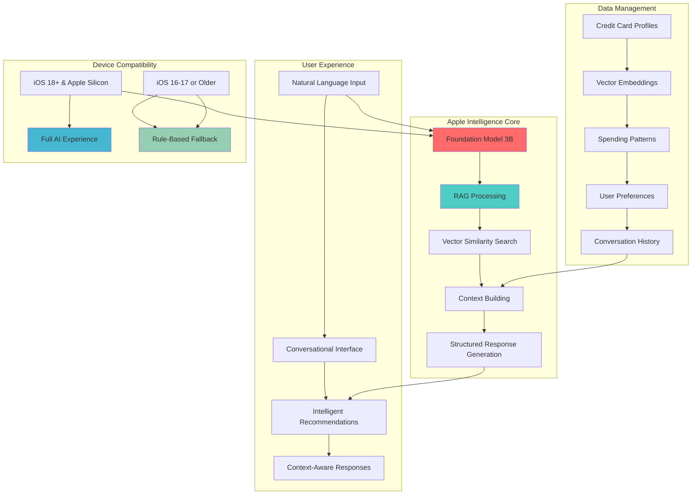
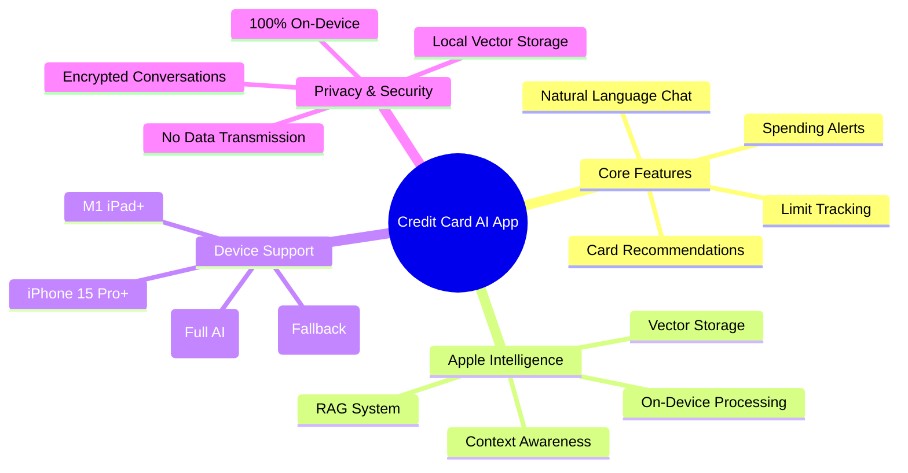

# MVP Definition & Scope Boundaries

## Project Overview
**Credit Card Chat Recommendation & Limit Reminder App with Apple Intelligence**

A conversational iOS app that leverages Apple Intelligence and RAG (Retrieval-Augmented Generation) to help users choose the best credit card for their purchases and manages credit limits intelligently.

## MVP Architecture Overview

## Feature Scope Matrix

## MVP Core Objective
**Single Focus**: Users input "I want to buy X", and the system recommends the best credit card from their existing cards, explains why, and alerts when limits are reached with automatic suggestions to switch cards.

## MVP Scope Boundaries

### ✅ What's INCLUDED in MVP
- **Input**: User's card list, basic cashback rules, quarterly/annual bonus categories (pre-built common cards)
- **Interaction**: Chat interface (user inputs spending scenarios, merchants, or categories)
- **Output**: Best credit card recommendation with reasoning and limit alerts
- **Simple Preferences**: Basic point system preferences (e.g., "prefer MR over UR")
- **Manual Limit Tracking**: Users manually update their spending progress
- **English/Chinese Bilingual**: Support for English or mixed language interaction

### ❌ What's EXCLUDED from MVP
- Real transaction data integration (no Plaid API initially)
- Advanced analytics or spending reports
- Multi-user features or social sharing
- Complex reward optimization algorithms
- Real-time bank API connections
- Advanced NLP processing

## Key Success Metrics
1. **Accuracy**: 90%+ correct card recommendations for common spending scenarios
2. **User Engagement**: Average 3+ interactions per session
3. **Limit Management**: 95%+ accuracy in limit tracking and alerts
4. **User Retention**: 60%+ weekly active users

## MVP Timeline
- **Phase 1**: Core chat interface and basic recommendations (2 weeks)
- **Phase 2**: Card management and limit tracking (2 weeks)
- **Phase 3**: Preference settings and advanced recommendations (1 week)
- **Phase 4**: Testing and refinement (1 week)

**Total MVP Development Time**: 6 weeks

## Technical Constraints
- iOS only (Swift/SwiftUI)
- Offline-first approach
- Local data storage (Core Data)
- Simple rule-based recommendation engine
- No external API dependencies for core functionality 