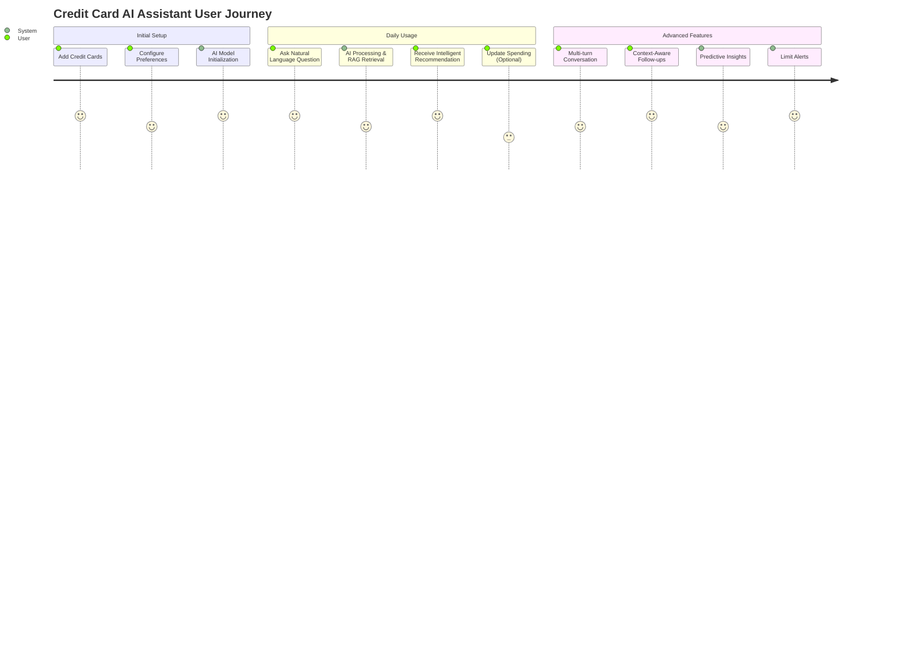
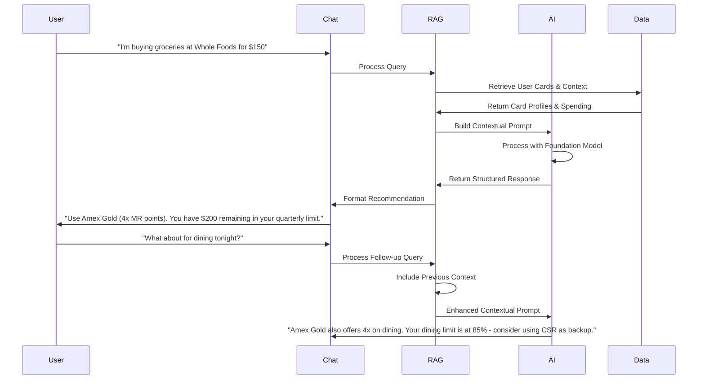

# User Stories & Use Cases

## User Experience Flow

## AI Interaction Flow

## Primary User Stories
**As a credit card user,**
- I want to add my existing credit cards to the app
- So that the system can recommend the best card for my purchases

**Acceptance Criteria:**
- User can add card name, type (Amex Gold, CSP, etc.)
- User can set basic reward categories for each card
- User can set quarterly/annual bonus categories
- User can set spending limits for bonus categories
- User can edit/delete cards

### 2. Chat-Based Recommendations
**As a user,**
- I want to ask "What card should I use for buying groceries at Costco?"
- So that I get an instant recommendation with reasoning

**Acceptance Criteria:**
- User can type natural language queries
- System recognizes spending categories (groceries, dining, travel, etc.)
- System recognizes common merchants (Costco, Amazon, etc.)
- System returns top 1-2 card recommendations
- System explains why each card is recommended
- System shows current spending progress for bonus categories

### 3. Limit Tracking & Alerts
**As a user,**
- I want to track my spending progress on bonus categories
- So that I know when to switch to another card

**Acceptance Criteria:**
- User can manually update spending amounts
- System shows progress bars for each bonus category
- System alerts when spending reaches 85% of limit
- System automatically suggests alternative cards when limits are reached
- User can set custom alert thresholds

### 4. Preference Settings
**As a user,**
- I want to set my preferred point systems
- So that recommendations prioritize my preferred rewards

**Acceptance Criteria:**
- User can select preferred point systems (MR, UR, TYP, etc.)
- System considers preferences in recommendations
- User can change preferences anytime
- System explains when preferences affect recommendations

## Detailed Use Cases

### Use Case 1: Grocery Shopping
**Scenario**: User wants to buy groceries at Whole Foods
**Input**: "I'm buying groceries at Whole Foods, what card should I use?"
**Expected Output**: 
- Primary recommendation: Amex Gold (4x points on groceries)
- Secondary recommendation: Chase Freedom (if in quarterly bonus)
- Current spending: $800/$1,000 on Amex Gold groceries
- Reasoning: "Amex Gold gives you 4x Membership Rewards points on groceries, and you have $200 remaining in your quarterly limit."

### Use Case 2: Dining Out
**Scenario**: User wants to dine at a restaurant
**Input**: "Going to dinner tonight, which card?"
**Expected Output**:
- Primary recommendation: Amex Gold (4x points on dining)
- Current spending: $1,200/$1,500 on dining
- Reasoning: "Amex Gold offers 4x points on dining worldwide, and you have $300 remaining in your limit."

### Use Case 3: Limit Reached
**Scenario**: User's Freedom card quarterly bonus is maxed out
**Input**: "Shopping at Amazon, what card?"
**Expected Output**:
- Primary recommendation: Chase Sapphire Preferred (1x points)
- Alert: "Your Chase Freedom quarterly bonus is maxed out ($1,500/$1,500)"
- Reasoning: "Since your Freedom quarterly bonus is maxed out, use CSP for 1x points on all purchases."

### Use Case 4: Travel Booking
**Scenario**: User booking a flight
**Input**: "Booking a flight to Europe, best card?"
**Expected Output**:
- Primary recommendation: Chase Sapphire Reserve (3x points on travel)
- Current spending: $2,000/$3,000 on travel
- Reasoning: "CSR gives you 3x points on travel purchases, and you have $1,000 remaining in your annual limit."

## Edge Cases

### Edge Case 1: No Cards Added
**Scenario**: User hasn't added any cards yet
**Input**: Any spending query
**Expected Output**: "Please add your credit cards first to get personalized recommendations."

### Edge Case 2: All Limits Reached
**Scenario**: All user's cards have reached their bonus limits
**Input**: Any spending query
**Expected Output**: "All your cards have reached their bonus limits. Consider using [card with highest base rewards] for general purchases."

### Edge Case 3: Unrecognized Category
**Scenario**: User asks about an obscure spending category
**Input**: "Buying pet supplies at PetSmart"
**Expected Output**: "I don't have specific data for pet supplies. Based on general purchases, I recommend [card with highest base rewards]."

### Edge Case 4: Multiple Cards with Same Rewards
**Scenario**: Multiple cards offer the same rewards for a category
**Input**: "Dining at a restaurant"
**Expected Output**: "Both Amex Gold and CSR offer 4x points on dining. I recommend Amex Gold since you prefer MR points, but CSR also works if you prefer UR points." 