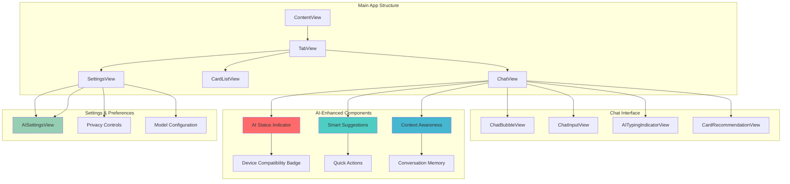
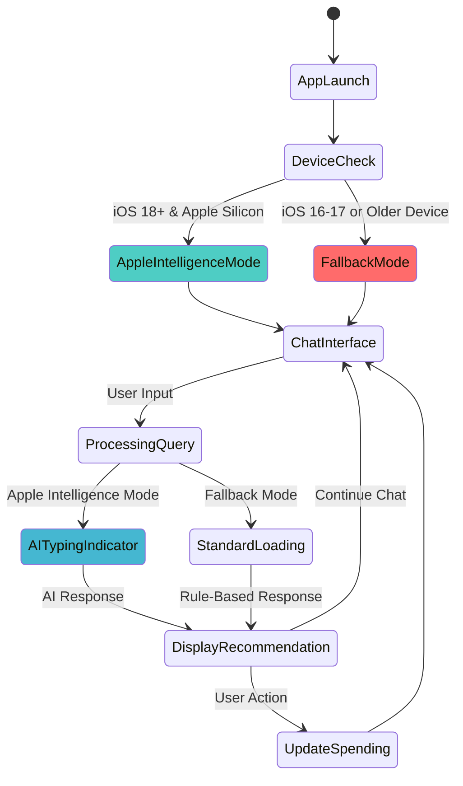

# Wireframes & UI/UX Design

## App Structure Overview

### Main Navigation
- **Tab 1**: Chat Interface (Primary)
- **Tab 2**: My Cards (Card Management)
- **Tab 3**: Settings (Preferences)

## UI Architecture Flow



## User Interface States



## Screen-by-Screen Wireframes

### 1. Chat Interface (Main Screen)

```
┌─────────────────────────────────────┐
│ [Back] Credit Card Assistant [Settings] │
├─────────────────────────────────────┤
│                                     │
│  🤖 Welcome! Ask me which card to   │
│     use for your next purchase.     │
│                                     │
│  👤 I'm buying groceries at         │
│     Whole Foods                     │
│                                     │
│  🤖 💳 Amex Gold (4x points)        │
│     Current: $800/$1,000            │
│     ✅ Best choice for groceries     │
│                                     │
│  👤 What about dining?              │
│                                     │
│  🤖 💳 Amex Gold (4x points)        │
│     Current: $1,200/$1,500          │
│     ⚠️ 80% limit reached            │
│     💡 Consider CSR as backup       │
│                                     │
├─────────────────────────────────────┤
│ [💬 Type your question...] [Send]   │
└─────────────────────────────────────┘
```

**Key Elements:**
- Chat bubbles with different styles for user vs AI
- Card recommendations with visual indicators
- Progress bars for spending limits
- Warning icons for approaching limits
- Quick action buttons for common queries

### 2. Card Management Screen

```
┌─────────────────────────────────────┐
│ [Back] My Cards [Add Card]          │
├─────────────────────────────────────┤
│                                     │
│  💳 Amex Gold                       │
│     Groceries: 4x MR               │
│     Dining: 4x MR                  │
│     Progress: ████████░░ 80%       │
│     [Edit] [Delete]                 │
│                                     │
│  💳 Chase Freedom                   │
│     Q1: Gas Stations 5%            │
│     Progress: ██████████ 100%      │
│     ⚠️ Limit reached               │
│     [Edit] [Delete]                 │
│                                     │
│  💳 Chase Sapphire Reserve          │
│     Travel: 3x UR                  │
│     Progress: █████░░░░░ 50%       │
│     [Edit] [Delete]                 │
│                                     │
│  [+ Add New Card]                   │
└─────────────────────────────────────┘
```

**Key Elements:**
- Card list with visual cards
- Progress bars for each category
- Warning indicators for limits
- Edit/Delete actions per card
- Add new card button

### 3. Add/Edit Card Screen

```
┌─────────────────────────────────────┐
│ [Cancel] Add Card [Save]            │
├─────────────────────────────────────┤
│                                     │
│  Card Name: [Amex Gold]             │
│                                     │
│  Card Type: [Dropdown: Amex Gold]   │
│                                     │
│  Reward Categories:                 │
│  ☑️ Groceries (4x MR)              │
│  ☑️ Dining (4x MR)                 │
│  ☐ Travel (3x MR)                  │
│  ☐ Gas (2x MR)                     │
│                                     │
│  Quarterly Bonus:                   │
│  Category: [None]                   │
│  Limit: [$0]                       │
│                                     │
│  Current Spending:                  │
│  Groceries: [$800 / $1,000]        │
│  Dining: [$1,200 / $1,500]         │
└─────────────────────────────────────┘
```

### 4. Settings Screen

```
┌─────────────────────────────────────┐
│ [Back] Settings                     │
├─────────────────────────────────────┤
│                                     │
│  Preferred Point System:            │
│  ○ Membership Rewards (MR)          │
│  ● Ultimate Rewards (UR)            │
│  ○ ThankYou Points (TYP)            │
│  ○ Cash Back                        │
│                                     │
│  Alert Thresholds:                  │
│  Limit Warning: [85%]               │
│  Limit Reached: [100%]              │
│                                     │
│  Language:                          │
│  ● English                          │
│  ○ Chinese                          │
│  ○ Bilingual                        │
│                                     │
│  [Reset All Data]                   │
│  [Export Data]                      │
└─────────────────────────────────────┘
```

## UI/UX Design Principles

### 1. Visual Hierarchy
- **Primary Actions**: Large, prominent buttons
- **Secondary Actions**: Smaller, less prominent
- **Information**: Clear typography with proper spacing
- **Warnings**: Red/orange colors for alerts

### 2. Color Scheme
- **Primary**: Blue (#007AFF) - iOS standard
- **Success**: Green (#34C759) - for good recommendations
- **Warning**: Orange (#FF9500) - for approaching limits
- **Error**: Red (#FF3B30) - for limit reached
- **Background**: Light gray (#F2F2F7)

### 3. Typography
- **Headers**: SF Pro Display, Bold, 20pt
- **Body Text**: SF Pro Text, Regular, 16pt
- **Captions**: SF Pro Text, Regular, 12pt
- **Card Names**: SF Pro Display, Semibold, 18pt

### 4. Interactive Elements
- **Buttons**: 44pt minimum touch target
- **Cards**: Tappable with subtle shadows
- **Progress Bars**: Animated on load
- **Chat Bubbles**: Rounded corners, different colors for user vs AI

### 5. Accessibility
- **VoiceOver**: Proper labels for all elements
- **Dynamic Type**: Support for larger text sizes
- **High Contrast**: Support for accessibility settings
- **Reduced Motion**: Respect user preferences

## Animation Guidelines

### 1. Chat Interface
- **Message Entry**: Smooth slide-up animation
- **AI Response**: Typing indicator, then fade-in
- **Card Recommendations**: Slide-in from right with bounce

### 2. Card Management
- **Add Card**: Modal slide-up from bottom
- **Delete Card**: Swipe-to-delete with confirmation
- **Progress Updates**: Smooth progress bar animations

### 3. Navigation
- **Tab Switching**: Standard iOS tab bar animations
- **Screen Transitions**: Push/pop with iOS defaults

## Responsive Design Considerations

### 1. Device Support
- **iPhone SE**: Compact layout, smaller text
- **iPhone 12/13/14**: Standard layout
- **iPhone 12/13/14 Pro Max**: Larger text, more spacing
- **iPad**: Split view support, larger cards

### 2. Orientation
- **Portrait**: Primary orientation
- **Landscape**: Adjusted layout for chat interface

## User Experience Flow

### 1. First Launch
1. Welcome screen with app explanation
2. Quick tutorial on adding cards
3. Sample chat interaction
4. Direct to card management

### 2. Daily Usage
1. Open app → Chat interface
2. Type spending query
3. Get instant recommendation
4. Optionally update spending amounts

### 3. Card Management
1. Add new cards as needed
2. Update spending progress
3. Review and adjust preferences
4. Monitor limit alerts 