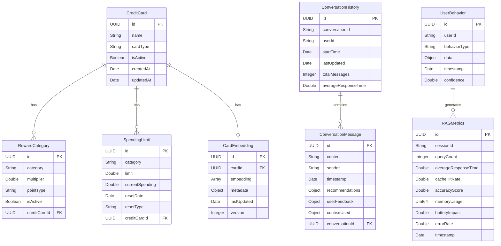
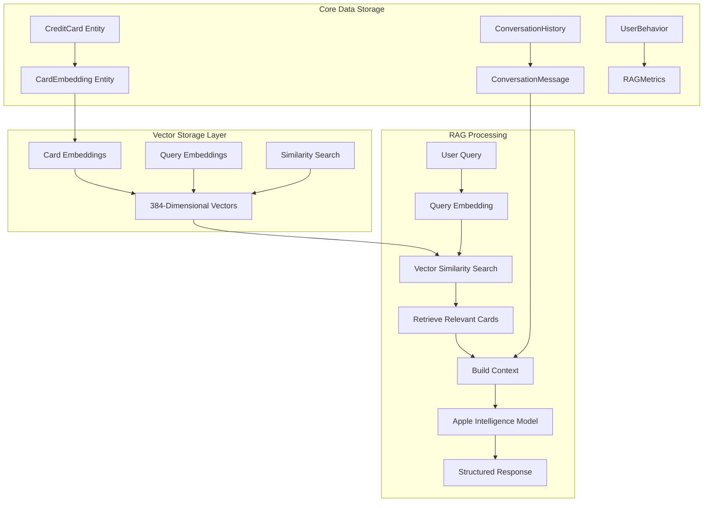

# Data Models & Database Schema

## Database Architecture Overview

### Core Data Schema with Vector Storage



### Vector Storage Architecture



## Core Data Models
```swift
struct CreditCard: Codable, Identifiable {
    let id: UUID
    var name: String
    var cardType: CardType
    var rewardCategories: [RewardCategory]
    var quarterlyBonus: QuarterlyBonus?
    var spendingLimits: [SpendingLimit]
    var isActive: Bool
    var createdAt: Date
    var updatedAt: Date
}

enum CardType: String, Codable, CaseIterable {
    case amexGold = "Amex Gold"
    case amexPlatinum = "Amex Platinum"
    case chaseFreedom = "Chase Freedom"
    case chaseSapphirePreferred = "Chase Sapphire Preferred"
    case chaseSapphireReserve = "Chase Sapphire Reserve"
    case citiDoubleCash = "Citi Double Cash"
    case custom = "Custom"
}

struct RewardCategory: Codable, Identifiable {
    let id: UUID
    var category: SpendingCategory
    var multiplier: Double
    var pointType: PointType
    var isActive: Bool
}

struct QuarterlyBonus: Codable {
    var category: SpendingCategory
    var multiplier: Double
    var pointType: PointType
    var limit: Double
    var currentSpending: Double
    var quarter: Int // 1-4
    var year: Int
}

struct SpendingLimit: Codable, Identifiable {
    let id: UUID
    var category: SpendingCategory
    var limit: Double
    var currentSpending: Double
    var resetDate: Date
    var resetType: ResetType
}
```

### 2. SpendingCategory Model
```swift
enum SpendingCategory: String, Codable, CaseIterable {
    // Basic categories
    case groceries = "Groceries"
    case dining = "Dining"
    case travel = "Travel"
    case gas = "Gas"
    case online = "Online Shopping"
    case drugstores = "Drugstores"
    case streaming = "Streaming"
    case transit = "Transit"
    case office = "Office Supply"
    case phone = "Phone Services"
    case general = "General Purchases"
    
    // Merchant-specific categories
    case costco = "Costco"
    case amazon = "Amazon"
    case wholeFoods = "Whole Foods"
    case target = "Target"
    case walmart = "Walmart"
    
    // Subcategories
    case airfare = "Airfare"
    case hotels = "Hotels"
    case restaurants = "Restaurants"
    case fastFood = "Fast Food"
    case coffee = "Coffee Shops"
}

enum PointType: String, Codable, CaseIterable {
    case membershipRewards = "MR"
    case ultimateRewards = "UR"
    case thankYouPoints = "TYP"
    case cashback = "Cash Back"
    case capitalOneMiles = "Capital One Miles"
    case discoverCashback = "Discover Cash Back"
}

enum ResetType: String, Codable {
    case monthly = "Monthly"
    case quarterly = "Quarterly"
    case annually = "Annually"
    case never = "Never"
}
```

### 3. UserPreferences Model
```swift
struct UserPreferences: Codable {
    var preferredPointSystem: PointType
    var alertThreshold: Double // Percentage (0.85 = 85%)
    var language: Language
    var notificationsEnabled: Bool
    var autoUpdateSpending: Bool
}

enum Language: String, Codable, CaseIterable {
    case english = "English"
    case chinese = "Chinese"
    case bilingual = "Bilingual"
}
```

### 4. ChatMessage Model
```swift
struct ChatMessage: Codable, Identifiable {
    let id: UUID
    var content: String
    var sender: MessageSender
    var timestamp: Date
    var cardRecommendations: [CardRecommendation]?
    var spendingUpdate: SpendingUpdate?
}

enum MessageSender: String, Codable {
    case user = "User"
    case assistant = "Assistant"
}

struct CardRecommendation: Codable, Identifiable {
    let id: UUID
    var cardId: UUID
    var cardName: String
    var category: SpendingCategory
    var multiplier: Double
    var pointType: PointType
    var reasoning: String
    var currentSpending: Double
    var limit: Double
    var isLimitReached: Bool
    var rank: Int // 1 for primary, 2 for secondary
}

struct SpendingUpdate: Codable {
    var cardId: UUID
    var category: SpendingCategory
    var amount: Double
    var previousAmount: Double
}
```

### 5. Merchant Model
```swift
struct Merchant: Codable, Identifiable {
    let id: UUID
    var name: String
    var category: SpendingCategory
    var aliases: [String] // Alternative names
    var isActive: Bool
}

// Pre-defined merchant mappings
let merchantMappings: [String: SpendingCategory] = [
    "costco": .costco,
    "whole foods": .wholeFoods,
    "amazon": .amazon,
    "target": .target,
    "walmart": .walmart,
    "starbucks": .coffee,
    "mcdonalds": .fastFood,
    "uber": .transit,
    "lyft": .transit,
    "netflix": .streaming,
    "spotify": .streaming,
    "cvs": .drugstores,
    "walgreens": .drugstores,
    "shell": .gas,
    "exxon": .gas,
    "chevron": .gas
]
```

## Database Schema (Core Data)

### 1. CreditCard Entity
```xml
<entity name="CreditCard" representedClassName="CreditCard" syncable="YES">
    <attribute name="id" optional="NO" attributeType="UUID" usesScalarValueType="NO"/>
    <attribute name="name" optional="NO" attributeType="String"/>
    <attribute name="cardType" optional="NO" attributeType="String"/>
    <attribute name="isActive" optional="NO" attributeType="Boolean" defaultValueString="YES" usesScalarValueType="YES"/>
    <attribute name="createdAt" optional="NO" attributeType="Date" usesScalarValueType="NO"/>
    <attribute name="updatedAt" optional="NO" attributeType="Date" usesScalarValueType="NO"/>
    
    <relationship name="rewardCategories" optional="YES" toMany="YES" deletionRule="Cascade" destinationEntity="RewardCategory" inverseName="creditCard" inverseEntity="RewardCategory"/>
    <relationship name="spendingLimits" optional="YES" toMany="YES" deletionRule="Cascade" destinationEntity="SpendingLimit" inverseName="creditCard" inverseEntity="SpendingLimit"/>
    <relationship name="quarterlyBonus" optional="YES" maxCount="1" deletionRule="Cascade" destinationEntity="QuarterlyBonus" inverseName="creditCard" inverseEntity="QuarterlyBonus"/>
</entity>
```

### 2. RewardCategory Entity
```xml
<entity name="RewardCategory" representedClassName="RewardCategory" syncable="YES">
    <attribute name="id" optional="NO" attributeType="UUID" usesScalarValueType="NO"/>
    <attribute name="category" optional="NO" attributeType="String"/>
    <attribute name="multiplier" optional="NO" attributeType="Double" defaultValueString="1.0" usesScalarValueType="YES"/>
    <attribute name="pointType" optional="NO" attributeType="String"/>
    <attribute name="isActive" optional="NO" attributeType="Boolean" defaultValueString="YES" usesScalarValueType="YES"/>
    
    <relationship name="creditCard" optional="NO" maxCount="1" deletionRule="Nullify" destinationEntity="CreditCard" inverseName="rewardCategories" inverseEntity="CreditCard"/>
</entity>
```

### 3. SpendingLimit Entity
```xml
<entity name="SpendingLimit" representedClassName="SpendingLimit" syncable="YES">
    <attribute name="id" optional="NO" attributeType="UUID" usesScalarValueType="NO"/>
    <attribute name="category" optional="NO" attributeType="String"/>
    <attribute name="limit" optional="NO" attributeType="Double" defaultValueString="0.0" usesScalarValueType="YES"/>
    <attribute name="currentSpending" optional="NO" attributeType="Double" defaultValueString="0.0" usesScalarValueType="YES"/>
    <attribute name="resetDate" optional="NO" attributeType="Date" usesScalarValueType="NO"/>
    <attribute name="resetType" optional="NO" attributeType="String"/>
    
    <relationship name="creditCard" optional="NO" maxCount="1" deletionRule="Nullify" destinationEntity="CreditCard" inverseName="spendingLimits" inverseEntity="CreditCard"/>
</entity>
```

### 4. ChatMessage Entity
```xml
<entity name="ChatMessage" representedClassName="ChatMessage" syncable="YES">
    <attribute name="id" optional="NO" attributeType="UUID" usesScalarValueType="NO"/>
    <attribute name="content" optional="NO" attributeType="String"/>
    <attribute name="sender" optional="NO" attributeType="String"/>
    <attribute name="timestamp" optional="NO" attributeType="Date" usesScalarValueType="NO"/>
    
    <relationship name="cardRecommendations" optional="YES" toMany="YES" deletionRule="Cascade" destinationEntity="CardRecommendation" inverseName="chatMessage" inverseEntity="CardRecommendation"/>
    <relationship name="spendingUpdate" optional="YES" maxCount="1" deletionRule="Cascade" destinationEntity="SpendingUpdate" inverseName="chatMessage" inverseEntity="SpendingUpdate"/>
</entity>
```

## Data Validation Rules

### 1. CreditCard Validation
- Name must not be empty
- Card type must be valid
- At least one reward category required
- Spending limits must be positive numbers

### 2. SpendingLimit Validation
- Current spending cannot exceed limit
- Reset date must be in the future
- Category must be valid

### 3. ChatMessage Validation
- Content must not be empty
- Sender must be valid
- Timestamp must be valid

## Data Migration Strategy

### Version 1.0 to 1.1
- Add quarterly bonus support
- Add merchant mappings
- Add language preferences

### Version 1.1 to 1.2
- Add spending history tracking
- Add notification preferences
- Add data export functionality

## Sample Data

### Pre-built Credit Cards
```json
{
  "name": "Amex Gold",
  "cardType": "amexGold",
  "rewardCategories": [
    {
      "category": "groceries",
      "multiplier": 4.0,
      "pointType": "membershipRewards",
      "isActive": true
    },
    {
      "category": "dining",
      "multiplier": 4.0,
      "pointType": "membershipRewards",
      "isActive": true
    }
  ],
  "spendingLimits": [
    {
      "category": "groceries",
      "limit": 25000.0,
      "currentSpending": 0.0,
      "resetType": "annually"
    },
    {
      "category": "dining",
      "limit": 25000.0,
      "currentSpending": 0.0,
      "resetType": "annually"
    }
  ]
}
```

### User Preferences Default
```json
{
  "preferredPointSystem": "membershipRewards",
  "alertThreshold": 0.85,
  "language": "english",
  "notificationsEnabled": true,
  "autoUpdateSpending": false
}
```

## Apple Intelligence RAG Models

### 1. Vector Storage Models
```swift
struct CardEmbedding: Codable, Identifiable {
    let id: UUID
    let cardId: UUID
    let embedding: [Float] // 384-dimensional vector for Apple Intelligence
    let metadata: CardEmbeddingMetadata
    let lastUpdated: Date
    let version: Int // For embedding model versioning
}

struct CardEmbeddingMetadata: Codable {
    let name: String
    let categories: [SpendingCategory]
    let multipliers: [Double]
    let pointType: PointType
    let averageMonthlySpending: Double
    let isActive: Bool
    let lastUsed: Date?
}

struct QueryEmbedding: Codable, Identifiable {
    let id: UUID
    let query: String
    let embedding: [Float]
    let category: SpendingCategory?
    let merchant: String?
    let amount: Double?
    let confidence: Float
    let createdAt: Date
}
```

### 2. RAG Context Models
```swift
struct UserContext: Codable {
    let userId: String
    let cards: [CardContextInfo]
    let preferences: UserPreferences
    let spendingPatterns: [SpendingPattern]
    let cardUsageHistory: [CardUsageHistory]
    let seasonalTrends: [SeasonalTrend]
    let currentDate: Date
    let contextMetadata: UserContextMetadata
}

struct CardContextInfo: Codable, Identifiable {
    let id: UUID
    let name: String
    let cardType: CardType
    let rewardCategories: [String] // Pre-formatted for prompt
    let currentSpending: [String] // Pre-formatted spending limits
    let quarterlyBonus: String?
    let isActive: Bool
    let lastUsed: Date?
    let monthlyAverage: Double
    let similarity: Double? // Similarity score from RAG retrieval
    let contextRelevance: Double? // Relevance score for current query
}

struct UserContextMetadata: Codable {
    let totalCards: Int
    let activeCards: Int
    let primaryPointSystems: [PointType]
    let averageMonthlySpending: Double
    let contextBuildTime: TimeInterval
    let dataFreshness: Date
}
```

### 3. RAG Retrieval Models
```swift
struct RetrievedContext: Codable {
    let relevantCards: [CardContextInfo]
    let overallRelevance: Double
    let retrievalMetadata: RetrievalMetadata
    let similarQueries: [String]? // Previously asked similar questions
    let contextSummary: String // Brief summary of retrieved context
}

struct RetrievalMetadata: Codable {
    let retrievalTime: TimeInterval
    let totalEmbeddingsSearched: Int
    let relevanceThreshold: Double
    let topKResults: Int
    let vectorSimilarityMethod: String // "cosine", "euclidean", etc.
}

struct SpendingPattern: Codable, Identifiable {
    let id: UUID
    let category: SpendingCategory
    let averageMonthlyAmount: Double
    let trendDirection: TrendDirection // increasing, decreasing, stable
    let seasonality: Seasonality?
    let preferredCards: [UUID] // Card IDs used most for this category
    let lastAnalyzed: Date
}

enum TrendDirection: String, Codable {
    case increasing = "increasing"
    case decreasing = "decreasing"
    case stable = "stable"
}

struct Seasonality: Codable {
    let pattern: SeasonalPattern
    let peakMonths: [Int] // Month numbers (1-12)
    let lowMonths: [Int]
    let variance: Double
}

enum SeasonalPattern: String, Codable {
    case quarterly = "quarterly"
    case holiday = "holiday"
    case summer = "summer"
    case none = "none"
}
```

### 4. Apple Intelligence Response Models
```swift
struct EnhancedRecommendationResponse: Codable {
    let primaryRecommendation: CardRecommendation
    let secondaryRecommendation: CardRecommendation?
    let reasoning: String
    let warnings: [String]
    let suggestions: [String]
    let confidence: Double
    let metadata: RecommendationMetadata
    let conversationContext: ConversationContext // For follow-up queries
    let ragMetrics: RAGMetrics // Performance and quality metrics
}

struct RecommendationMetadata: Codable {
    let responseTime: TimeInterval
    let model: String // "apple_intelligence_3b"
    let contextRelevance: Double
    let embeddingSimilarity: Double
    let promptTokens: Int
    let responseTokens: Int
    let modelVersion: String
    let processingDate: Date
}

struct ConversationContext: Codable {
    let conversationId: String
    let previousQueries: [String]
    let previousRecommendations: [CardRecommendation]
    let contextCarryover: [String: Any] // Codable dictionary for context
    let sessionStartTime: Date
    let lastInteractionTime: Date
}

struct RAGMetrics: Codable {
    let vectorSearchTime: TimeInterval
    let contextBuildTime: TimeInterval
    let promptGenerationTime: TimeInterval
    let llmInferenceTime: TimeInterval
    let responseParsingTime: TimeInterval
    let totalRAGTime: TimeInterval
    let cacheHitRate: Double
    let contextCompressionRatio: Double // How much context was compressed
}
```

### 5. Conversation & Memory Models
```swift
struct ConversationHistory: Codable, Identifiable {
    let id: UUID
    let conversationId: String
    let userId: String
    let messages: [ConversationMessage]
    let startTime: Date
    let lastUpdated: Date
    let totalMessages: Int
    let averageResponseTime: TimeInterval
}

struct ConversationMessage: Codable, Identifiable {
    let id: UUID
    let content: String
    let sender: MessageSender
    let timestamp: Date
    let recommendations: [CardRecommendation]?
    let userFeedback: UserFeedback?
    let contextUsed: ConversationContext?
}

struct UserFeedback: Codable {
    let rating: FeedbackRating // thumbsUp, thumbsDown, neutral
    let comment: String?
    let wasRecommendationUsed: Bool
    let actualCardUsed: UUID? // Card ID actually used
    let providedAt: Date
}

enum FeedbackRating: String, Codable {
    case thumbsUp = "thumbs_up"
    case thumbsDown = "thumbs_down"
    case neutral = "neutral"
}

struct UserBehavior: Codable, Identifiable {
    let id: UUID
    let userId: String
    let behaviorType: BehaviorType
    let data: [String: Any] // Flexible data storage
    let timestamp: Date
    let confidence: Double
}

enum BehaviorType: String, Codable {
    case cardPreference = "card_preference"
    case categorySpending = "category_spending"
    case merchantPreference = "merchant_preference"
    case timingPattern = "timing_pattern"
    case limitAwareness = "limit_awareness"
}
```

### 6. Performance & Analytics Models
```swift
struct RAGPerformanceMetrics: Codable, Identifiable {
    let id: UUID
    let sessionId: String
    let queryCount: Int
    let averageResponseTime: TimeInterval
    let cacheHitRate: Double
    let accuracyScore: Double // Based on user feedback
    let memoryUsage: UInt64 // Bytes
    let batteryImpact: Double // Percentage
    let errorRate: Double
    let timestamp: Date
}

struct ModelMetrics: Codable {
    let modelVersion: String
    let inferencesPerformed: Int
    let averageInferenceTime: TimeInterval
    let memoryFootprint: UInt64
    let accuracy: Double
    let lastCalibrated: Date
    let supportedLanguages: [Language]
}

struct EmbeddingCacheMetrics: Codable {
    let totalEmbeddings: Int
    let cacheSize: UInt64 // Bytes
    let hitRate: Double
    let missRate: Double
    let evictionCount: Int
    let averageRetrievalTime: TimeInterval
    let lastCleanup: Date
}
```

## Core Data Schema Updates for RAG

### 1. CardEmbedding Entity
```xml
<entity name="CardEmbedding" representedClassName="CardEmbedding" syncable="YES">
    <attribute name="id" optional="NO" attributeType="UUID" usesScalarValueType="NO"/>
    <attribute name="cardId" optional="NO" attributeType="UUID" usesScalarValueType="NO"/>
    <attribute name="embedding" optional="NO" attributeType="Transformable" valueTransformerName="NSSecureUnarchiveFromDataTransformer"/>
    <attribute name="metadata" optional="NO" attributeType="Transformable" valueTransformerName="NSSecureUnarchiveFromDataTransformer"/>
    <attribute name="lastUpdated" optional="NO" attributeType="Date" usesScalarValueType="NO"/>
    <attribute name="version" optional="NO" attributeType="Integer 32" defaultValueString="1" usesScalarValueType="YES"/>
    
    <relationship name="creditCard" optional="NO" maxCount="1" deletionRule="Nullify" destinationEntity="CreditCard" inverseName="embedding" inverseEntity="CreditCard"/>
</entity>
```

### 2. ConversationHistory Entity
```xml
<entity name="ConversationHistory" representedClassName="ConversationHistory" syncable="YES">
    <attribute name="id" optional="NO" attributeType="UUID" usesScalarValueType="NO"/>
    <attribute name="conversationId" optional="NO" attributeType="String"/>
    <attribute name="userId" optional="NO" attributeType="String"/>
    <attribute name="startTime" optional="NO" attributeType="Date" usesScalarValueType="NO"/>
    <attribute name="lastUpdated" optional="NO" attributeType="Date" usesScalarValueType="NO"/>
    <attribute name="totalMessages" optional="NO" attributeType="Integer 32" defaultValueString="0" usesScalarValueType="YES"/>
    <attribute name="averageResponseTime" optional="NO" attributeType="Double" defaultValueString="0.0" usesScalarValueType="YES"/>
    
    <relationship name="messages" optional="YES" toMany="YES" deletionRule="Cascade" destinationEntity="ConversationMessage" inverseName="conversation" inverseEntity="ConversationMessage"/>
</entity>
```

### 3. UserBehavior Entity
```xml
<entity name="UserBehavior" representedClassName="UserBehavior" syncable="YES">
    <attribute name="id" optional="NO" attributeType="UUID" usesScalarValueType="NO"/>
    <attribute name="userId" optional="NO" attributeType="String"/>
    <attribute name="behaviorType" optional="NO" attributeType="String"/>
    <attribute name="data" optional="NO" attributeType="Transformable" valueTransformerName="NSSecureUnarchiveFromDataTransformer"/>
    <attribute name="timestamp" optional="NO" attributeType="Date" usesScalarValueType="NO"/>
    <attribute name="confidence" optional="NO" attributeType="Double" defaultValueString="0.0" usesScalarValueType="YES"/>
</entity>
```

## Data Migration Strategy for RAG

### Version 2.0 Migration (Apple Intelligence Integration)
```swift
class RAGDataMigration {
    func migrateToRAGSupport() async throws {
        // 1. Generate embeddings for existing cards
        await generateInitialEmbeddings()
        
        // 2. Create conversation history from existing chat messages
        await migrateExistingChatHistory()
        
        // 3. Analyze existing spending patterns for behavior insights
        await extractSpendingPatterns()
        
        // 4. Initialize RAG cache structures
        await initializeRAGCaches()
    }
    
    private func generateInitialEmbeddings() async {
        let existingCards = try await dataManager.fetchAllCards()
        
        for card in existingCards {
            let cardDescription = buildCardDescription(card)
            let embedding = try await appleIntelligenceRAG.generateEmbedding(for: cardDescription)
            
            let cardEmbedding = CardEmbedding(
                id: UUID(),
                cardId: card.id,
                embedding: embedding,
                metadata: CardEmbeddingMetadata(from: card),
                lastUpdated: Date(),
                version: 1
            )
            
            try await dataManager.store(cardEmbedding)
        }
    }
}
```

## Sample RAG Data
```json
{
  "cardEmbedding": {
    "id": "123e4567-e89b-12d3-a456-426614174000",
    "cardId": "456e7890-e89b-12d3-a456-426614174001",
    "embedding": [0.123, -0.456, 0.789, /* ... 384 dimensions */],
    "metadata": {
      "name": "Amex Gold",
      "categories": ["groceries", "dining"],
      "multipliers": [4.0, 4.0],
      "pointType": "membershipRewards",
      "averageMonthlySpending": 1200.0,
      "isActive": true,
      "lastUsed": "2024-01-15T10:30:00Z"
    },
    "lastUpdated": "2024-01-15T10:30:00Z",
    "version": 1
  },
  
  "userContext": {
    "userId": "user123",
    "cards": [
      {
        "name": "Amex Gold",
        "topCategories": ["Groceries: 4x", "Dining: 4x", "General: 1x"],
        "spendingStatus": "Groceries: $800/$1000 (80%) - AVAILABLE",
        "isActive": true
      }
    ],
    "contextMetadata": {
      "totalCards": 3,
      "activeCards": 3,
      "primaryPointSystems": ["membershipRewards", "ultimateRewards"],
      "averageMonthlySpending": 2500.0
    }
  }
}
``` 