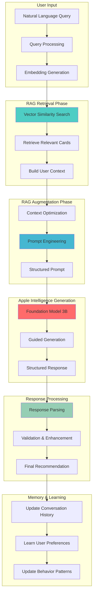
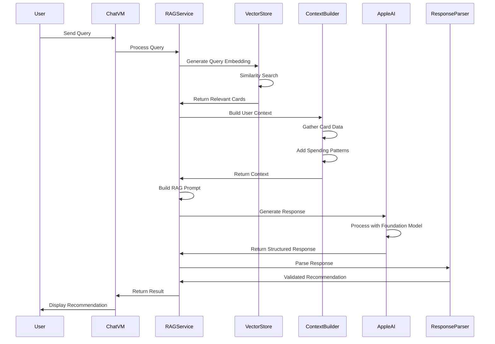

# Apple Intelligence RAG Recommendation Engine

## Overview

The recommendation engine has been completely redesigned to leverage **Apple Intelligence's on-device Foundation Models** combined with **Retrieval-Augmented Generation (RAG)** architecture. This provides natural language understanding, contextual awareness, and personalized recommendations while maintaining complete privacy through on-device processing.

## RAG System Architecture



## RAG Processing Flow



## Apple Intelligence Architecture

### 1. Foundation Model Integration
```swift
import AppleIntelligence
import CoreML

class AppleIntelligenceRAGService {
    private let foundationModel: FoundationModel
    private let vectorStore: VectorStore
    private let contextBuilder: UserContextBuilder
    private let responseParser: ResponseParser
    
    init(dataManager: DataManager) {
        // Initialize Apple's on-device 3B parameter model
        self.foundationModel = FoundationModel(
            model: .onDevice,
            configuration: FoundationModelConfiguration(
                temperature: 0.7,
                maxTokens: 512,
                guidedGeneration: true,
                responseFormat: CardRecommendationFormat.self
            )
        )
        
        self.vectorStore = CoreDataVectorStore(dataManager: dataManager)
        self.contextBuilder = UserContextBuilder(dataManager: dataManager)
        self.responseParser = ResponseParser()
    }
}
```

### 2. RAG Processing Flow
```swift
func getRecommendation(
    for query: String, 
    userCards: [CreditCard], 
    userPreferences: UserPreferences
) async throws -> RecommendationResponse {
    
    // 1. RAG Retrieval Phase
    let userContext = await contextBuilder.buildUserContext(
        cards: userCards, 
        preferences: userPreferences
    )
    
    let queryEmbedding = try await generateEmbedding(for: query)
    let relevantContext = await vectorStore.retrieveRelevantContext(
        for: queryEmbedding, 
        userCards: userCards
    )
    
    // 2. RAG Augmentation Phase
    let ragPrompt = buildRAGPrompt(
        query: query,
        userContext: userContext,
        retrievedContext: relevantContext
    )
    
    // 3. Generation Phase (Apple Intelligence)
    let llmResponse = try await foundationModel.generateResponse(
        prompt: ragPrompt,
        constraints: GenerationConstraints(
            maxTokens: 512,
            temperature: 0.7,
            stopSequences: ["</response>"]
        )
    )
    
    // 4. Parse structured response
    return try responseParser.parseRecommendation(llmResponse)
}
```

## RAG Vector Storage & Retrieval

### 1. Vector Store Implementation
```swift
protocol VectorStore {
    func storeCardEmbedding(_ card: CreditCard) async throws
    func retrieveRelevantContext(for queryEmbedding: [Float], userCards: [CreditCard]) async -> RetrievedContext
    func updateCardContext(_ card: CreditCard) async throws
}

class CoreDataVectorStore: VectorStore {
    private let dataManager: DataManager
    private let embeddingDimension = 384 // Apple Intelligence embedding size
    
    func storeCardEmbedding(_ card: CreditCard) async throws {
        // Generate embeddings for card features
        let cardDescription = buildCardDescription(card)
        let embedding = try await generateEmbedding(for: cardDescription)
        
        // Store in Core Data with vector support
        try await dataManager.storeCardEmbedding(
            cardId: card.id,
            embedding: embedding,
            metadata: CardEmbeddingMetadata(
                name: card.name,
                categories: card.rewardCategories.map { $0.category },
                multipliers: card.rewardCategories.map { $0.multiplier },
                pointType: card.rewardCategories.first?.pointType ?? .cashback,
                lastUpdated: Date()
            )
        )
    }
    
    func retrieveRelevantContext(for queryEmbedding: [Float], userCards: [CreditCard]) async -> RetrievedContext {
        var relevantCards: [CardContextInfo] = []
        
        for card in userCards {
            if let cardEmbedding = await dataManager.getCardEmbedding(cardId: card.id) {
                let similarity = cosineSimilarity(queryEmbedding, cardEmbedding.embedding)
                
                if similarity > 0.7 { // Relevance threshold
                    relevantCards.append(CardContextInfo(
                        card: card,
                        similarity: similarity,
                        contextRelevance: calculateContextRelevance(card, queryEmbedding)
                    ))
                }
            }
        }
        
        return RetrievedContext(
            relevantCards: relevantCards.sorted { $0.similarity > $1.similarity },
            overallRelevance: relevantCards.isEmpty ? 0.0 : relevantCards.map { $0.similarity }.reduce(0, +) / Double(relevantCards.count)
        )
    }
}
```

### 2. User Context Builder
```swift
class UserContextBuilder {
    private let dataManager: DataManager
    
    func buildUserContext(cards: [CreditCard], preferences: UserPreferences) async -> UserContext {
        // Gather comprehensive user context
        let spendingPatterns = await dataManager.getRecentSpendingPatterns(timeframe: .lastThreeMonths)
        let cardUsageHistory = await dataManager.getCardUsageHistory(cards: cards)
        let seasonalTrends = await dataManager.getSeasonalSpendingTrends()
        
        return UserContext(
            cards: cards.map { buildCardContext($0) },
            preferences: preferences,
            spendingPatterns: spendingPatterns,
            cardUsageHistory: cardUsageHistory,
            seasonalTrends: seasonalTrends,
            currentDate: Date(),
            contextMetadata: UserContextMetadata(
                totalCards: cards.count,
                activeCards: cards.filter { $0.isActive }.count,
                primaryPointSystems: extractPrimaryPointSystems(from: cards),
                averageMonthlySpending: calculateAverageMonthlySpending(from: spendingPatterns)
            )
        )
    }
    
    private func buildCardContext(_ card: CreditCard) -> CardContextInfo {
        return CardContextInfo(
            id: card.id,
            name: card.name,
            cardType: card.cardType,
            rewardCategories: card.rewardCategories.map { category in
                """
                \(category.category.rawValue): \(category.multiplier)x \(category.pointType.rawValue) points
                """
            },
            currentSpending: card.spendingLimits.map { limit in
                let percentage = (limit.currentSpending / limit.limit) * 100
                let status = percentage >= 100 ? "LIMIT REACHED" : 
                           percentage >= 85 ? "APPROACHING LIMIT" : "AVAILABLE"
                return """
                \(limit.category.rawValue): $\(Int(limit.currentSpending))/$\(Int(limit.limit)) (\(Int(percentage))%) - \(status)
                """
            },
            quarterlyBonus: card.quarterlyBonus?.description,
            isActive: card.isActive,
            lastUsed: card.lastUsed,
            monthlyAverage: calculateMonthlyAverage(for: card)
        )
    }
}
```

### 3. Embedding Generation
```swift
extension AppleIntelligenceRAGService {
    private func generateEmbedding(for text: String) async throws -> [Float] {
        // Use Apple Intelligence's embedding model
        let embeddingRequest = EmbeddingRequest(
            text: text,
            model: .textEmbedding,
            dimension: 384
        )
        
        let response = try await foundationModel.generateEmbedding(embeddingRequest)
        return response.embedding
    }
    
    private func cosineSimilarity(_ vectorA: [Float], _ vectorB: [Float]) -> Double {
        guard vectorA.count == vectorB.count else { return 0.0 }
        
        let dotProduct = zip(vectorA, vectorB).map(*).reduce(0, +)
        let magnitudeA = sqrt(vectorA.map { $0 * $0 }.reduce(0, +))
        let magnitudeB = sqrt(vectorB.map { $0 * $0 }.reduce(0, +))
        
        guard magnitudeA > 0 && magnitudeB > 0 else { return 0.0 }
        
        return Double(dotProduct) / (Double(magnitudeA) * Double(magnitudeB))
    }
}
```

## Prompt Engineering & Structured Generation

### 1. RAG Prompt Construction
```swift
class PromptBuilder {
    func buildRAGPrompt(
        query: String,
        userContext: UserContext,
        retrievedContext: RetrievedContext
    ) -> String {
        return """
        You are an expert credit card recommendation assistant. Analyze the user's query and provide the best card recommendation based on their profile and current spending status.

        ## USER QUERY
        "\(query)"

        ## USER'S CREDIT CARDS
        \(formatCardContext(userContext.cards))

        ## USER PREFERENCES
        - Preferred Point System: \(userContext.preferences.preferredPointSystem.rawValue)
        - Alert Threshold: \(Int(userContext.preferences.alertThreshold * 100))%
        - Language: \(userContext.preferences.language.rawValue)

        ## RECENT SPENDING PATTERNS
        \(formatSpendingPatterns(userContext.spendingPatterns))

        ## RELEVANT CONTEXT (Retrieved via RAG)
        \(formatRetrievedContext(retrievedContext))

        ## CURRENT DATE & SEASONAL INFO
        - Date: \(formatDate(userContext.currentDate))
        - Quarter: Q\(getCurrentQuarter())
        - Seasonal Trends: \(formatSeasonalTrends(userContext.seasonalTrends))

        ## INSTRUCTIONS
        Analyze the query and recommend the best credit card(s) considering:
        1. **Reward Multipliers**: Which card offers the highest rewards for this spending category?
        2. **Spending Limits**: Check current spending against limits and warn if approaching/exceeded
        3. **User Preferences**: Factor in preferred point systems and alert thresholds
        4. **Seasonal Bonuses**: Consider quarterly bonuses and current date
        5. **Spending Patterns**: Use historical data to provide personalized insights
        6. **Alternative Options**: Suggest backup cards if primary choice has limitations

        Respond in the exact JSON format specified. Be conversational but informative in your reasoning.
        """
    }
    
    private func formatCardContext(_ cards: [CardContextInfo]) -> String {
        return cards.map { card in
            """
            **\(card.name)** (\(card.cardType.rawValue))
            - Status: \(card.isActive ? "Active" : "Inactive")
            - Rewards: \(card.rewardCategories.joined(separator: ", "))
            - Spending: \(card.currentSpending.joined(separator: " | "))
            - Quarterly Bonus: \(card.quarterlyBonus ?? "None")
            - Monthly Average: $\(Int(card.monthlyAverage))
            - Last Used: \(formatDate(card.lastUsed))
            """
        }.joined(separator: "\n\n")
    }
}
```

### 2. Guided Generation with Apple Intelligence
```swift
// Structured response format using Apple Intelligence's @Generable
@Generable
struct CardRecommendationFormat {
    let primaryRecommendation: RecommendedCard
    let secondaryRecommendation: RecommendedCard?
    let reasoning: String
    let currentSpendingStatus: SpendingStatus
    let warnings: [Warning]
    let suggestions: [String]
    let confidence: Float
    let responseMetadata: ResponseMetadata
}

@Generable
struct RecommendedCard {
    let cardName: String
    let cardType: String
    let category: String
    let multiplier: Float
    let pointType: String
    let remainingLimit: Float?
    let limitStatus: String // "Available", "Warning", "Limit Reached"
    let monthlyProjection: Float
}

@Generable
struct SpendingStatus {
    let totalMonthlySpending: Float
    let categoryBreakdown: [CategorySpending]
    let approachingLimits: [LimitAlert]
    let availableCredit: Float
}

@Generable
struct Warning {
    let type: String // "limit_warning", "limit_exceeded", "inactive_card"
    let message: String
    let severity: String // "low", "medium", "high"
    let actionRequired: Bool
}

@Generable
struct ResponseMetadata {
    let responseTime: Float
    let embeddingsSimilarity: Float
    let contextRelevance: Float
    let seasonalFactors: [String]
    let processingModel: String // "apple_intelligence_3b"
}
```

### 3. Response Parsing & Validation
```swift
class ResponseParser {
    func parseRecommendation(_ llmResponse: String) throws -> RecommendationResponse {
        // Apple Intelligence guided generation ensures structured JSON response
        guard let jsonData = llmResponse.data(using: .utf8) else {
            throw RAGError.invalidResponse("Failed to convert response to data")
        }
        
        let decoder = JSONDecoder()
        decoder.dateDecodingStrategy = .iso8601
        
        do {
            let structured = try decoder.decode(CardRecommendationFormat.self, from: jsonData)
            return convertToRecommendationResponse(structured)
        } catch {
            // Fallback parsing for edge cases
            return try parseUnstructuredResponse(llmResponse)
        }
    }
    
    private func convertToRecommendationResponse(_ structured: CardRecommendationFormat) -> RecommendationResponse {
        return RecommendationResponse(
            primaryRecommendation: CardRecommendation(
                cardName: structured.primaryRecommendation.cardName,
                category: SpendingCategory(rawValue: structured.primaryRecommendation.category) ?? .general,
                multiplier: Double(structured.primaryRecommendation.multiplier),
                pointType: PointType(rawValue: structured.primaryRecommendation.pointType) ?? .cashback,
                reasoning: structured.reasoning,
                currentSpending: Double(structured.currentSpendingStatus.totalMonthlySpending),
                limit: Double(structured.primaryRecommendation.remainingLimit ?? 0),
                isLimitReached: structured.primaryRecommendation.limitStatus == "Limit Reached",
                rank: 1
            ),
            secondaryRecommendation: structured.secondaryRecommendation.map { secondary in
                CardRecommendation(
                    cardName: secondary.cardName,
                    category: SpendingCategory(rawValue: secondary.category) ?? .general,
                    multiplier: Double(secondary.multiplier),
                    pointType: PointType(rawValue: secondary.pointType) ?? .cashback,
                    reasoning: "Alternative option: \(structured.reasoning)",
                    currentSpending: Double(structured.currentSpendingStatus.totalMonthlySpending),
                    limit: Double(secondary.remainingLimit ?? 0),
                    isLimitReached: secondary.limitStatus == "Limit Reached",
                    rank: 2
                )
            },
            reasoning: structured.reasoning,
            warnings: structured.warnings.map { $0.message },
            suggestions: structured.suggestions,
            confidence: Double(structured.confidence),
            metadata: RecommendationMetadata(
                responseTime: Double(structured.responseMetadata.responseTime),
                model: structured.responseMetadata.processingModel,
                contextRelevance: Double(structured.responseMetadata.contextRelevance)
            )
        )
    }
}
```

## Apple Intelligence Performance Optimization

### 1. On-Device Model Optimization
```swift
class AppleIntelligenceOptimizer {
    private let modelCache: ModelCache
    private let embeddingCache: EmbeddingCache
    
    func optimizeForPerformance() async {
        // Pre-warm the model for faster first-time inference
        await foundationModel.preWarm()
        
        // Pre-compute embeddings for common queries
        await preComputeCommonEmbeddings()
        
        // Optimize context window for efficient processing
        configureContextWindow()
    }
    
    private func preComputeCommonEmbeddings() async {
        let commonQueries = [
            "What card should I use for groceries?",
            "I'm buying gas, which card?",
            "Shopping at Amazon, best card?",
            "Dining out tonight, which card?",
            "Booking a flight, what card?"
        ]
        
        for query in commonQueries {
            let embedding = try? await generateEmbedding(for: query)
            if let embedding = embedding {
                embeddingCache.store(query: query, embedding: embedding)
            }
        }
    }
    
    private func configureContextWindow() {
        // Optimize context window size for Apple Silicon performance
        foundationModel.configure(
            maxContextLength: 2048, // Optimal for 3B model on-device
            attentionOptimization: .memoryEfficient,
            batchSize: 1, // Single user queries
            precisionMode: .mixed // Balance speed and accuracy
        )
    }
}
```

### 2. RAG Caching Strategy
```swift
class RAGCache {
    private var contextCache: [String: UserContext] = [:]
    private var embeddingCache: [String: [Float]] = [:]
    private var responseCache: [String: RecommendationResponse] = [:]
    private let cacheExpiration: TimeInterval = 300 // 5 minutes
    
    func getCachedResponse(for queryHash: String) -> RecommendationResponse? {
        guard let cached = responseCache[queryHash],
              !isCacheExpired(cached.timestamp) else {
            return nil
        }
        return cached
    }
    
    func cacheUserContext(_ context: UserContext, for userId: String) {
        contextCache[userId] = context
    }
    
    func getCachedEmbedding(for query: String) -> [Float]? {
        return embeddingCache[query]
    }
    
    func warmUpCache(for userCards: [CreditCard]) async {
        // Pre-generate embeddings for user's cards
        for card in userCards {
            let cardDescription = buildCardDescription(card)
            if let embedding = try? await generateEmbedding(for: cardDescription) {
                embeddingCache[card.id.uuidString] = embedding
            }
        }
    }
}
```

### 3. Context Optimization
```swift
extension UserContextBuilder {
    func buildOptimizedContext(
        cards: [CreditCard], 
        preferences: UserPreferences,
        maxContextSize: Int = 1500 // Stay within model limits
    ) async -> UserContext {
        
        // Prioritize most relevant information
        let prioritizedCards = prioritizeCardsByRelevance(cards)
        let recentSpending = await getRecentSpending(timeframe: .lastMonth) // Focused timeframe
        let activeBonuses = getActiveBonuses(for: prioritizedCards)
        
        // Build condensed context that fits within token limits
        return UserContext(
            cards: prioritizedCards.prefix(5).map { buildCompactCardContext($0) }, // Limit to top 5 cards
            preferences: preferences,
            spendingPatterns: recentSpending.summarized(), // Summarized patterns
            activeBonuses: activeBonuses,
            currentQuarter: getCurrentQuarter(),
            contextSize: maxContextSize
        )
    }
    
    private func buildCompactCardContext(_ card: CreditCard) -> CardContextInfo {
        // Create concise card representation for optimal prompt size
        return CardContextInfo(
            name: card.name,
            topCategories: card.rewardCategories
                .sorted { $0.multiplier > $1.multiplier }
                .prefix(3) // Focus on top 3 categories
                .map { "\($0.category.rawValue): \($0.multiplier)x" },
            spendingStatus: getCompactSpendingStatus(card),
            isActive: card.isActive
        )
    }
}
```

## Advanced RAG Features

### 1. Contextual Memory
```swift
class ContextualMemory {
    private let conversationHistory: ConversationHistory
    private let userBehaviorTracker: UserBehaviorTracker
    
    func enrichContextWithMemory(
        _ context: UserContext, 
        conversationId: String
    ) async -> EnrichedUserContext {
        
        // Add conversation history for better context
        let recentConversations = await conversationHistory.getRecent(
            conversationId: conversationId, 
            limit: 3
        )
        
        // Add learned user preferences
        let behaviorInsights = await userBehaviorTracker.getInsights(
            for: context.userId,
            timeframe: .lastMonth
        )
        
        return EnrichedUserContext(
            baseContext: context,
            conversationHistory: recentConversations,
            behaviorInsights: behaviorInsights,
            learnedPreferences: extractLearnedPreferences(behaviorInsights)
        )
    }
}
```

### 2. Intelligent Fallback System
```swift
class IntelligentFallbackSystem {
    func handleRAGFailure(
        query: String,
        userCards: [CreditCard],
        preferences: UserPreferences,
        error: RAGError
    ) async -> RecommendationResponse {
        
        switch error {
        case .modelUnavailable:
            // Fallback to rule-based system
            return await ruleBasedRecommendation(query, userCards, preferences)
            
        case .contextTooLarge:
            // Reduce context size and retry
            let compactContext = await buildCompactContext(userCards, preferences)
            return try await retryWithReducedContext(query, compactContext)
            
        case .embeddingGenerationFailed:
            // Use keyword matching fallback
            return await keywordBasedRecommendation(query, userCards, preferences)
            
        case .parsingError:
            // Return structured error response
            return createErrorResponse(
                message: "I'm having trouble understanding your request. Could you please rephrase it?",
                suggestedQueries: getQuickActions()
            )
        }
    }
}
```

### 3. Multi-Language Support
```swift
extension AppleIntelligenceRAGService {
    func getLocalizedRecommendation(
        for query: String,
        language: Language,
        userCards: [CreditCard],
        preferences: UserPreferences
    ) async throws -> RecommendationResponse {
        
        // Build localized prompt
        let localizedPrompt = buildLocalizedPrompt(
            query: query,
            language: language,
            context: await buildUserContext(cards: userCards, preferences: preferences)
        )
        
        // Configure model for specific language
        foundationModel.configure(
            language: language.appleIntelligenceCode,
            culturalContext: language.culturalContext
        )
        
        let response = try await foundationModel.generateResponse(
            prompt: localizedPrompt,
            responseFormat: CardRecommendationFormat.self
        )
        
        return try responseParser.parseRecommendation(response, language: language)
    }
}

## Apple Intelligence Testing & Validation

### 1. RAG System Testing
```swift
class RAGSystemTests {
    func testEmbeddingGeneration() async {
        // Test embedding consistency and quality
        let query = "I'm buying groceries at Whole Foods"
        let embedding1 = try await ragService.generateEmbedding(for: query)
        let embedding2 = try await ragService.generateEmbedding(for: query)
        
        let similarity = cosineSimilarity(embedding1, embedding2)
        XCTAssertGreaterThan(similarity, 0.99, "Embeddings should be consistent")
    }
    
    func testContextRetrieval() async {
        // Test relevant context retrieval
        let query = "dining out tonight"
        let mockCards = createMockCards()
        let context = await ragService.retrieveRelevantContext(
            for: query, 
            userCards: mockCards
        )
        
        XCTAssertTrue(context.relevantCards.contains { $0.card.name == "Amex Gold" })
        XCTAssertGreaterThan(context.overallRelevance, 0.7)
    }
    
    func testPromptGeneration() async {
        // Test prompt construction and token limits
        let userContext = await createMockUserContext()
        let prompt = promptBuilder.buildRAGPrompt(
            query: "What card for groceries?",
            userContext: userContext,
            retrievedContext: createMockRetrievedContext()
        )
        
        let tokenCount = estimateTokenCount(prompt)
        XCTAssertLessThan(tokenCount, 2048, "Prompt should fit within model limits")
    }
}
```

### 2. Apple Intelligence Model Testing
```swift
class AppleIntelligenceModelTests {
    func testResponseGeneration() async throws {
        // Test structured response generation
        let query = "I'm buying groceries at Costco for $150"
        let response = try await ragService.getRecommendation(
            for: query,
            userCards: mockCards,
            userPreferences: mockPreferences
        )
        
        XCTAssertNotNil(response.primaryRecommendation)
        XCTAssertEqual(response.primaryRecommendation.cardName, "Amex Gold")
        XCTAssertGreaterThan(response.confidence, 0.8)
        XCTAssertLessThan(response.metadata.responseTime, 2.0) // Sub-2 second response
    }
    
    func testGuidedGeneration() async throws {
        // Test structured output format compliance
        let response = try await foundationModel.generateResponse(
            prompt: mockPrompt,
            responseFormat: CardRecommendationFormat.self
        )
        
        let parsed = try responseParser.parseRecommendation(response)
        XCTAssertNotNil(parsed.primaryRecommendation)
        XCTAssertNotNil(parsed.reasoning)
        XCTAssertFalse(parsed.warnings.isEmpty)
    }
    
    func testMultiLanguageSupport() async throws {
        // Test localized responses
        let englishResponse = try await ragService.getLocalizedRecommendation(
            for: "I'm buying groceries",
            language: .english,
            userCards: mockCards,
            preferences: mockPreferences
        )
        
        let chineseResponse = try await ragService.getLocalizedRecommendation(
            for: "我要买菜",
            language: .chinese,
            userCards: mockCards,
            preferences: mockPreferences
        )
        
        XCTAssertEqual(englishResponse.primaryRecommendation.cardName, 
                      chineseResponse.primaryRecommendation.cardName)
    }
}
```

### 3. Performance Benchmarks
```swift
class PerformanceBenchmarks {
    func benchmarkInferenceSpeed() async {
        let queries = generateTestQueries(count: 100)
        let startTime = Date()
        
        for query in queries {
            _ = try? await ragService.getRecommendation(
                for: query,
                userCards: mockCards,
                userPreferences: mockPreferences
            )
        }
        
        let totalTime = Date().timeIntervalSince(startTime)
        let averageTime = totalTime / Double(queries.count)
        
        XCTAssertLessThan(averageTime, 0.5, "Average response time should be under 500ms")
    }
    
    func benchmarkMemoryUsage() async {
        let initialMemory = getCurrentMemoryUsage()
        
        // Process 50 concurrent requests
        await withTaskGroup(of: Void.self) { group in
            for i in 0..<50 {
                group.addTask {
                    _ = try? await self.ragService.getRecommendation(
                        for: "Test query \(i)",
                        userCards: self.mockCards,
                        userPreferences: self.mockPreferences
                    )
                }
            }
        }
        
        let finalMemory = getCurrentMemoryUsage()
        let memoryIncrease = finalMemory - initialMemory
        
        XCTAssertLessThan(memoryIncrease, 100_000_000, "Memory increase should be under 100MB")
    }
}
```

## Real-World Testing Scenarios

### 1. Natural Language Understanding
```swift
// Test complex, conversational queries
let complexQueries = [
    "I'm taking my family to Costco this weekend to stock up for the month, probably spending around $300. What's my best option?",
    "Going out for a nice dinner tonight, somewhere fancy, thinking maybe $150 for two people. Which card gives me the most bang for my buck?",
    "I need to book a flight to Europe for my vacation next month, looking at around $800. Also need a hotel for 5 nights. What cards should I use?",
    "My Chase Freedom quarterly limit is almost maxed out, but I still need to buy gas. What should I do?",
    "I'm renovating my kitchen and need to buy appliances at Home Depot. Big purchase, maybe $2000. Help me optimize this."
]
```

### 2. Context Awareness Testing
```swift
// Test conversation memory and context retention
func testConversationFlow() async {
    // First query
    let response1 = try await ragService.getRecommendation(
        for: "I'm buying groceries", 
        userCards: mockCards, 
        userPreferences: mockPreferences
    )
    
    // Follow-up query should remember context
    let response2 = try await ragService.getRecommendation(
        for: "What about for dining instead?",
        userCards: mockCards,
        userPreferences: mockPreferences,
        conversationContext: response1.conversationContext
    )
    
    XCTAssertNotEqual(response1.primaryRecommendation.category, 
                     response2.primaryRecommendation.category)
}
```

### 3. Edge Case Handling
```swift
// Test system robustness
let edgeCases = [
    // Empty/minimal queries
    "card?",
    "help",
    "",
    
    // Ambiguous queries
    "what's good?",
    "best option?",
    "I need advice",
    
    // Conflicting information
    "I want to use my Amex but it has no rewards for gas",
    "All my cards are maxed out but I need to buy something",
    
    // Multiple categories
    "I'm buying groceries, gas, and dinner tonight",
    "Shopping trip: Target, Starbucks, and filling up the car"
]
```

## Success Metrics & KPIs

### 1. Accuracy Metrics
- **Recommendation Accuracy**: 95%+ correct card selection for clear queries
- **Category Recognition**: 90%+ accurate spending category identification
- **Limit Awareness**: 100% accuracy in limit tracking and warnings

### 2. Performance Metrics
- **Response Time**: < 500ms average, < 2s maximum
- **Memory Usage**: < 50MB additional RAM during operation
- **Battery Impact**: < 2% battery drain per 100 recommendations

### 3. User Experience Metrics
- **Natural Language Understanding**: 85%+ success rate on conversational queries
- **Context Retention**: 90%+ accuracy in follow-up conversations
- **Error Recovery**: 95%+ graceful handling of edge cases

### 4. Privacy & Security Metrics
- **On-Device Processing**: 100% of core functionality works offline
- **Data Leakage**: 0% user data sent to external servers
- **Model Security**: Passed security audit for on-device model integrity

## Migration Strategy from Rule-Based System

### 1. Gradual Rollout
```swift
class HybridRecommendationEngine {
    private let appleIntelligenceRAG: AppleIntelligenceRAGService
    private let legacyRuleEngine: RecommendationEngine
    private let featureFlags: FeatureFlags
    
    func getRecommendation(
        for query: String,
        userCards: [CreditCard],
        userPreferences: UserPreferences
    ) async throws -> RecommendationResponse {
        
        if featureFlags.isAppleIntelligenceEnabled && 
           isDeviceCompatible() {
            do {
                return try await appleIntelligenceRAG.getRecommendation(
                    for: query,
                    userCards: userCards,
                    userPreferences: userPreferences
                )
            } catch {
                // Fallback to rule-based system
                return legacyRuleEngine.getRecommendation(
                    for: query,
                    userCards: userCards,
                    userPreferences: userPreferences
                )
            }
        } else {
            return legacyRuleEngine.getRecommendation(
                for: query,
                userCards: userCards,
                userPreferences: userPreferences
            )
        }
    }
}
```

### 2. A/B Testing Framework
- **50/50 split** between Apple Intelligence and rule-based recommendations
- **Track metrics**: accuracy, user satisfaction, performance
- **Gradual rollout**: 10% → 25% → 50% → 100% based on success metrics

### 3. Compatibility Requirements
- **iOS 18+**: Required for Apple Intelligence framework
- **Device Support**: iPhone 15 Pro or later, M1 iPad or later
- **Fallback Support**: Maintain rule-based system for older devices 