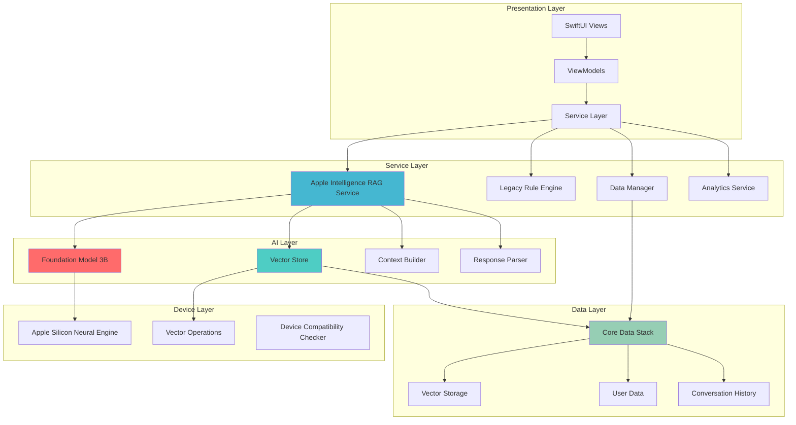
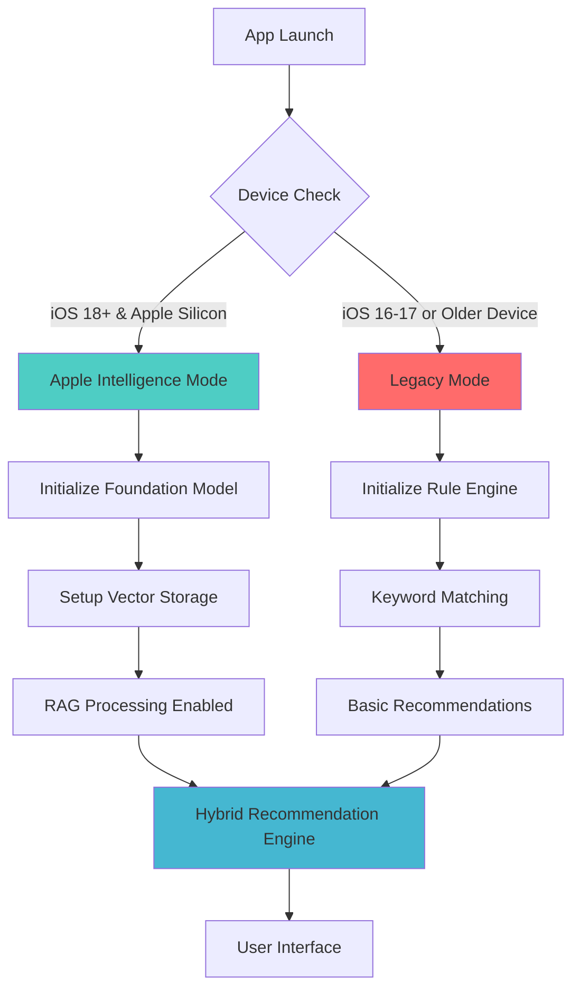

# Technical Architecture & Implementation

## Technology Stack

### Core Technologies
- **Language**: Swift 5.9+
- **UI Framework**: SwiftUI
- **AI Framework**: Apple Intelligence (iOS 18+)
- **Data Persistence**: Core Data with Vector Storage
- **Architecture Pattern**: MVVM + RAG (Retrieval-Augmented Generation)
- **Dependency Management**: Swift Package Manager
- **Minimum iOS Version**: iOS 18.0+ (for Apple Intelligence), iOS 16.0+ (fallback)

## System Architecture Overview



## Device Compatibility Architecture



### Apple Intelligence Integration
```swift
// Apple Intelligence Framework
import AppleIntelligence
import CoreML

// Foundation Models Framework for on-device AI
frameworks: [
    "AppleIntelligence.framework",
    "CoreML.framework", 
    "Foundation.framework",
    "SwiftUI.framework"
]
```

### Enhanced Dependencies
```swift
// Swift Package Manager Dependencies
dependencies: [
    .package(url: "https://github.com/onevcat/Kingfisher.git", from: "7.0.0"), // Image loading
    .package(url: "https://github.com/Alamofire/Alamofire.git", from: "5.0.0"), // Networking (future use)
    .package(url: "https://github.com/realm/SwiftLint.git", from: "0.50.0"), // Code quality
    .package(url: "https://github.com/apple/swift-numerics.git", from: "1.0.0") // Vector operations
]
```

### Device Requirements
```swift
// Apple Intelligence Requirements
enum DeviceCompatibility {
    case appleIntelligenceSupported // iPhone 15 Pro+, M1 iPad+
    case fallbackModeOnly // iPhone 12+, older iPads
    
    var supportsOnDeviceAI: Bool {
        switch self {
        case .appleIntelligenceSupported: return true
        case .fallbackModeOnly: return false
        }
    }
}
```

## Apple Intelligence RAG Project Structure

```
CreditCardApp/
├── App/
│   ├── CreditCardApp.swift
│   └── ServiceContainer.swift
├── Models/
│   ├── Core/
│   │   ├── CreditCard.swift
│   │   ├── SpendingCategory.swift
│   │   ├── UserPreferences.swift
│   │   └── ChatMessage.swift
│   ├── RAG/
│   │   ├── VectorStorage/
│   │   │   ├── CardEmbedding.swift
│   │   │   ├── QueryEmbedding.swift
│   │   │   └── VectorStore.swift
│   │   ├── Context/
│   │   │   ├── UserContext.swift
│   │   │   ├── RetrievedContext.swift
│   │   │   └── ConversationContext.swift
│   │   └── Response/
│   │       ├── RAGResponse.swift
│   │       ├── RAGMetrics.swift
│   │       └── AppleIntelligenceFormat.swift
│   ├── Extensions/
│   │   ├── CreditCard+Extensions.swift
│   │   ├── Date+Extensions.swift
│   │   └── Array+VectorOperations.swift
│   └── CoreData/
│       ├── CreditCardApp.xcdatamodeld
│       ├── CoreDataManager.swift
│       ├── CoreDataStack.swift
│       └── VectorStorageManager.swift
├── Views/
│   ├── Main/
│   │   ├── ContentView.swift
│   │   ├── TabView.swift
│   │   └── NavigationView.swift
│   ├── Chat/
│   │   ├── ChatView.swift
│   │   ├── ChatBubbleView.swift
│   │   ├── CardRecommendationView.swift
│   │   └── ChatInputView.swift
│   ├── Cards/
│   │   ├── CardListView.swift
│   │   ├── CardDetailView.swift
│   │   ├── AddCardView.swift
│   │   └── CardRowView.swift
│   ├── Settings/
│   │   ├── SettingsView.swift
│   │   ├── PreferencesView.swift
│   │   └── AboutView.swift
│   └── Components/
│       ├── ProgressBarView.swift
│       ├── AlertView.swift
│       ├── LoadingView.swift
│       └── EmptyStateView.swift
├── ViewModels/
│   ├── ChatViewModel.swift
│   ├── CardListViewModel.swift
│   ├── AddCardViewModel.swift
│   ├── SettingsViewModel.swift
│   └── BaseViewModel.swift
├── Services/
│   ├── AppleIntelligence/
│   │   ├── AppleIntelligenceRAGService.swift
│   │   ├── FoundationModelManager.swift
│   │   ├── EmbeddingService.swift
│   │   └── PromptBuilder.swift
│   ├── RAG/
│   │   ├── VectorStoreService.swift
│   │   ├── UserContextBuilder.swift
│   │   ├── ResponseParser.swift
│   │   └── RAGCache.swift
│   ├── Legacy/
│   │   ├── RecommendationEngine.swift (fallback)
│   │   ├── NLPProcessor.swift (fallback)
│   │   └── HybridRecommendationEngine.swift
│   ├── Data/
│   │   ├── DataManager.swift
│   │   ├── CoreDataStack.swift
│   │   └── VectorDataManager.swift
│   ├── Analytics/
│   │   ├── AnalyticsService.swift
│   │   ├── RAGMetricsCollector.swift
│   │   └── AIPerformanceMonitor.swift
│   └── Utils/
│       ├── NotificationService.swift
│       ├── DeviceCompatibilityChecker.swift
│       └── AIModelVersionManager.swift
├── Utils/
│   ├── Constants.swift
│   ├── Extensions/
│   │   ├── String+Extensions.swift
│   │   ├── Color+Extensions.swift
│   │   └── View+Extensions.swift
│   └── Helpers/
│       ├── DateHelper.swift
│       ├── CurrencyHelper.swift
│       └── ValidationHelper.swift
├── Resources/
│   ├── Assets.xcassets
│   ├── Localizable.strings
│   ├── Info.plist
│   └── SampleData/
│       └── credit_cards.json
└── Tests/
    ├── UnitTests/
    ├── IntegrationTests/
    └── UITests/
```

## Core Architecture Components

### 1. MVVM Architecture
```swift
// Base ViewModel Protocol
protocol BaseViewModel: ObservableObject {
    var isLoading: Bool { get set }
    var errorMessage: String? { get set }
    func handleError(_ error: Error)
}

// Base ViewModel Implementation
class BaseViewModelImpl: BaseViewModel {
    @Published var isLoading: Bool = false
    @Published var errorMessage: String?
    
    func handleError(_ error: Error) {
        DispatchQueue.main.async {
            self.errorMessage = error.localizedDescription
            self.isLoading = false
        }
    }
}
```

### 2. Dependency Injection
```swift
// Service Container
class ServiceContainer {
    static let shared = ServiceContainer()
    
    lazy var recommendationEngine: RecommendationEngine = {
        RecommendationEngine()
    }()
    
    lazy var dataManager: DataManager = {
        DataManager(coreDataStack: coreDataStack)
    }()
    
    lazy var nlpProcessor: NLPProcessor = {
        NLPProcessor()
    }()
    
    private lazy var coreDataStack: CoreDataStack = {
        CoreDataStack()
    }()
}

// ViewModel Factory
class ViewModelFactory {
    static func makeChatViewModel() -> ChatViewModel {
        ChatViewModel(
            recommendationEngine: ServiceContainer.shared.recommendationEngine,
            dataManager: ServiceContainer.shared.dataManager,
            nlpProcessor: ServiceContainer.shared.nlpProcessor
        )
    }
}
```

### 3. Core Data Stack
```swift
class CoreDataStack {
    static let shared = CoreDataStack()
    
    lazy var persistentContainer: NSPersistentContainer = {
        let container = NSPersistentContainer(name: "CreditCardApp")
        container.loadPersistentStores { _, error in
            if let error = error {
                fatalError("Core Data error: \(error)")
            }
        }
        return container
    }()
    
    var context: NSManagedObjectContext {
        persistentContainer.viewContext
    }
    
    func saveContext() {
        if context.hasChanges {
            do {
                try context.save()
            } catch {
                print("Core Data save error: \(error)")
            }
        }
    }
}
```

## Key ViewModels

### 1. ChatViewModel
```swift
class ChatViewModel: BaseViewModelImpl {
    @Published var messages: [ChatMessage] = []
    @Published var inputText: String = ""
    @Published var isTyping: Bool = false
    
    private let recommendationEngine: RecommendationEngine
    private let dataManager: DataManager
    private let nlpProcessor: NLPProcessor
    
    init(recommendationEngine: RecommendationEngine, 
         dataManager: DataManager, 
         nlpProcessor: NLPProcessor) {
        self.recommendationEngine = recommendationEngine
        self.dataManager = dataManager
        self.nlpProcessor = nlpProcessor
        super.init()
        loadInitialMessage()
    }
    
    func sendMessage() {
        guard !inputText.trimmingCharacters(in: .whitespacesAndNewlines).isEmpty else { return }
        
        let userMessage = ChatMessage(
            id: UUID(),
            content: inputText,
            sender: .user,
            timestamp: Date()
        )
        
        messages.append(userMessage)
        let query = inputText
        inputText = ""
        
        processUserQuery(query)
    }
    
    private func processUserQuery(_ query: String) {
        isTyping = true
        
        Task {
            do {
                let response = try await recommendationEngine.getRecommendation(for: query)
                
                DispatchQueue.main.async {
                    self.isTyping = false
                    self.handleRecommendationResponse(response)
                }
            } catch {
                DispatchQueue.main.async {
                    self.isTyping = false
                    self.handleError(error)
                }
            }
        }
    }
}
```

### 2. CardListViewModel
```swift
class CardListViewModel: BaseViewModelImpl {
    @Published var cards: [CreditCard] = []
    @Published var showingAddCard = false
    
    private let dataManager: DataManager
    
    init(dataManager: DataManager) {
        self.dataManager = dataManager
        super.init()
        loadCards()
    }
    
    func loadCards() {
        isLoading = true
        
        Task {
            do {
                let loadedCards = try await dataManager.fetchCards()
                DispatchQueue.main.async {
                    self.cards = loadedCards
                    self.isLoading = false
                }
            } catch {
                DispatchQueue.main.async {
                    self.handleError(error)
                }
            }
        }
    }
    
    func deleteCard(_ card: CreditCard) {
        Task {
            do {
                try await dataManager.deleteCard(card)
                await loadCards()
            } catch {
                DispatchQueue.main.async {
                    self.handleError(error)
                }
            }
        }
    }
}
```

## Key Views

### 1. Main ContentView
```swift
struct ContentView: View {
    @StateObject private var cardListViewModel = ViewModelFactory.makeCardListViewModel()
    
    var body: some View {
        TabView {
            ChatView()
                .tabItem {
                    Image(systemName: "message.fill")
                    Text("Chat")
                }
            
            CardListView()
                .environmentObject(cardListViewModel)
                .tabItem {
                    Image(systemName: "creditcard.fill")
                    Text("My Cards")
                }
            
            SettingsView()
                .tabItem {
                    Image(systemName: "gear")
                    Text("Settings")
                }
        }
        .accentColor(.blue)
    }
}
```

### 2. ChatView
```swift
struct ChatView: View {
    @StateObject private var viewModel = ViewModelFactory.makeChatViewModel()
    
    var body: some View {
        NavigationView {
            VStack {
                ScrollViewReader { proxy in
                    ScrollView {
                        LazyVStack(spacing: 12) {
                            ForEach(viewModel.messages) { message in
                                ChatBubbleView(message: message)
                                    .id(message.id)
                            }
                            
                            if viewModel.isTyping {
                                TypingIndicatorView()
                            }
                        }
                        .padding()
                    }
                    .onChange(of: viewModel.messages.count) { _ in
                        withAnimation {
                            proxy.scrollTo(viewModel.messages.last?.id, anchor: .bottom)
                        }
                    }
                }
                
                ChatInputView(
                    text: $viewModel.inputText,
                    onSend: viewModel.sendMessage
                )
            }
            .navigationTitle("Credit Card Assistant")
            .navigationBarTitleDisplayMode(.inline)
        }
    }
}
```

## Data Flow

### 1. Chat Flow
```
User Input → ChatViewModel → NLPProcessor → RecommendationEngine → Response Generation → UI Update
```

### 2. Card Management Flow
```
User Action → ViewModel → DataManager → Core Data → UI Update
```

### 3. Settings Flow
```
User Preference → ViewModel → DataManager → Core Data → App Configuration Update
```

## Performance Considerations

### 1. Memory Management
- Use weak references in closures
- Implement proper cleanup in ViewModels
- Use lazy loading for large datasets

### 2. UI Performance
- Use LazyVStack for chat messages
- Implement pagination for card lists
- Use background processing for heavy computations

### 3. Data Performance
- Implement Core Data batch operations
- Use background contexts for data operations
- Cache frequently accessed data

## Security Considerations

### 1. Data Protection
- Use Core Data encryption
- Implement secure data deletion
- Protect sensitive user information

### 2. Input Validation
- Validate all user inputs
- Sanitize chat messages
- Prevent injection attacks

## Testing Strategy

### 1. Unit Tests
- ViewModel logic
- Service layer functionality
- Data validation

### 2. Integration Tests
- Core Data operations
- Recommendation engine
- End-to-end workflows

### 3. UI Tests
- User interactions
- Navigation flows
- Accessibility features

## Deployment Configuration

### 1. Build Configurations
- Debug: Development with logging
- Release: Production optimized
- TestFlight: Beta testing

### 2. Environment Variables
- API endpoints (future)
- Feature flags
- Analytics keys

### 3. App Store Preparation
- App icons and screenshots
- App description and keywords
- Privacy policy and terms of service 