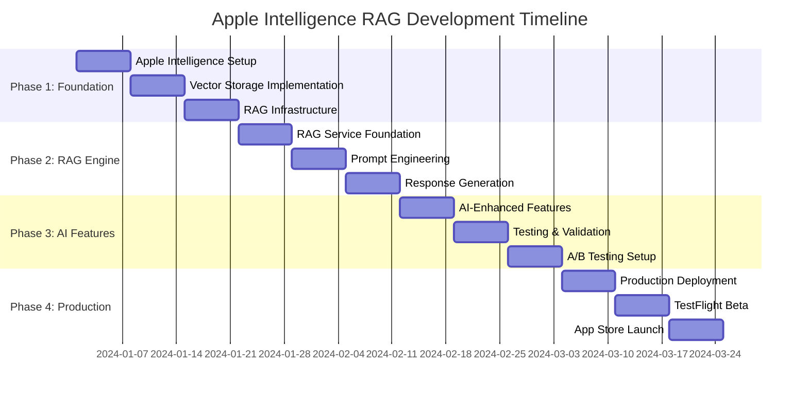
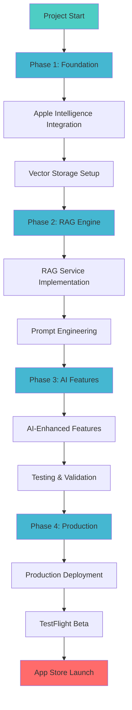

# Apple Intelligence RAG Implementation Timeline

## Updated MVP Timeline: 8 Weeks (Extended for AI Integration)

## Development Timeline Overview

## Development Phases Flow

### Phase 1: Foundation & Apple Intelligence Setup (Week 1-2)
**Goal**: Set up project structure, Apple Intelligence integration, and core data models with vector storage

#### Week 1: Project Setup & Apple Intelligence Foundation
**Days 1-2: Project Foundation & Device Compatibility**
- [ ] Create Xcode project with SwiftUI and iOS 18+ support
- [ ] Set up project structure for Apple Intelligence RAG architecture
- [ ] Configure Swift Package Manager dependencies (including swift-numerics)
- [ ] Implement DeviceCompatibilityChecker for Apple Intelligence support
- [ ] Set up basic app navigation (TabView) with AI status indicators

**Days 3-4: Apple Intelligence Framework Integration**
- [ ] Import and configure Apple Intelligence framework
- [ ] Set up FoundationModelManager for on-device 3B model
- [ ] Configure Foundation Models framework
- [ ] Implement basic embedding service structure
- [ ] Test Apple Intelligence availability and initialization

**Days 5-7: Enhanced Data Models & Vector Storage**
- [ ] Implement core CreditCard model
- [ ] Implement SpendingCategory enum
- [ ] Implement UserPreferences model with AI settings
- [ ] Create RAG-specific models (CardEmbedding, UserContext, etc.)
- [ ] Set up Core Data with vector storage support
- [ ] Create VectorDataManager and CoreDataStack

#### Week 2: RAG Infrastructure & Chat Interface
**Days 8-10: Vector Storage & Embedding System**
- [ ] Implement VectorStoreService
- [ ] Create EmbeddingService with Apple Intelligence integration
- [ ] Set up vector similarity search algorithms
- [ ] Implement CardEmbedding generation and storage
- [ ] Test embedding consistency and performance

**Days 11-12: User Context & RAG Cache**
- [ ] Implement UserContextBuilder
- [ ] Create conversation history tracking
- [ ] Set up RAGCache with performance optimization
- [ ] Implement context compression for token limits
- [ ] Add user behavior tracking foundation

**Days 13-14: Chat Interface Foundation**
- [ ] Create enhanced ChatView with AI typing indicators
- [ ] Implement ChatBubbleView with AI response styling
- [ ] Create ChatInputView with smart suggestions
- [ ] Add AI recommendation display components
- [ ] Set up basic chat navigation and scrolling
- [ ] Set up sample data loading
- [ ] Test Core Data operations
- [ ] Add data validation

### Phase 2: Apple Intelligence RAG Engine (Week 3-4)
**Goal**: Implement Apple Intelligence RAG system with prompt engineering and response parsing

#### Week 3: Apple Intelligence RAG Core
**Days 15-17: RAG Service Foundation**
- [ ] Create AppleIntelligenceRAGService class
- [ ] Implement RAG processing flow (Retrieval → Augmentation → Generation)
- [ ] Set up PromptBuilder with structured templates
- [ ] Create ResponseParser with guided generation
- [ ] Implement error handling and fallback systems
- [ ] Test basic RAG pipeline with sample data

**Days 18-19: Prompt Engineering & Context Management**
- [ ] Design and implement RAG prompt templates
- [ ] Create context optimization for token limits
- [ ] Implement conversation memory and context carryover
- [ ] Add multi-language prompt support
- [ ] Test prompt effectiveness with various query types
- [ ] Optimize context compression algorithms

**Days 20-21: Structured Response Generation**
- [ ] Implement @Generable response formats
- [ ] Create CardRecommendationFormat and related structs
- [ ] Add response validation and parsing
- [ ] Implement confidence scoring based on RAG metrics
- [ ] Add reasoning explanation generation
- [ ] Test structured output consistency

#### Week 4: Integration & Hybrid System
**Days 22-24: Chat Integration & Apple Intelligence**
- [ ] Connect ChatViewModel to AppleIntelligenceRAGService
- [ ] Implement async RAG processing with proper loading states
- [ ] Create HybridRecommendationEngine for device compatibility
- [ ] Add AI recommendation display components
- [ ] Implement conversation context persistence
- [ ] Test end-to-end RAG flow with real device

**Days 25-26: Fallback System & Card Management**
- [ ] Implement legacy rule-based fallback system
- [ ] Create device capability detection and routing
- [ ] Enhance AddCardView with embedding generation
- [ ] Update card editing to regenerate embeddings
- [ ] Add AI-powered card insights and recommendations
- [ ] Implement smart spending limit suggestions

**Days 27-28: Performance Optimization & Caching**
- [ ] Optimize Apple Intelligence model performance
- [ ] Implement smart caching for embeddings and contexts
- [ ] Add memory management for large vector operations
- [ ] Test performance on various device capabilities
- [ ] Implement background embedding generation
- [ ] Add performance monitoring and metrics collection

### Phase 3: AI-Enhanced Features & User Experience (Week 5-6)
**Goal**: Add AI-powered insights, preference learning, and advanced user experience features

#### Week 5: AI-Enhanced Features
**Days 29-31: Intelligent Settings & Preferences**
- [ ] Implement AISettingsView with model configuration options
- [ ] Add AI-powered point system preference learning
- [ ] Create intelligent alert threshold suggestions
- [ ] Add conversation personality settings
- [ ] Implement AI model version management
- [ ] Add privacy and data usage controls

**Days 32-33: Smart Limit Management & Insights**
- [ ] Implement AI-powered spending pattern analysis
- [ ] Create predictive limit warnings based on behavior
- [ ] Add smart card switching suggestions
- [ ] Implement seasonal spending insights
- [ ] Create personalized financial recommendations
- [ ] Add spending optimization suggestions

**Days 34-35: Advanced Conversational Features**
- [ ] Implement conversation memory and context persistence
- [ ] Add multi-turn conversation support
- [ ] Create follow-up question suggestions
- [ ] Implement conversational spending updates
- [ ] Add AI-powered spending pattern insights
- [ ] Create personalized quick actions

#### Week 6: AI Testing & Optimization
**Days 36-38: Apple Intelligence Testing & Validation**
- [ ] Comprehensive RAG system testing
- [ ] Apple Intelligence model accuracy validation
- [ ] Performance benchmarking on various devices
- [ ] Embedding consistency and quality testing
- [ ] Conversation flow and memory testing
- [ ] Multi-language support validation

**Days 39-40: A/B Testing Framework & Analytics** 
- [ ] Implement A/B testing between AI and rule-based systems
- [ ] Set up AI performance metrics collection
- [ ] Create user feedback collection system
- [ ] Implement recommendation accuracy tracking
- [ ] Add user satisfaction surveys
- [ ] Set up analytics dashboard for AI performance

**Days 41-42: Final AI Optimization**
- [ ] Optimize prompt templates based on testing results
- [ ] Fine-tune context compression algorithms
- [ ] Implement intelligent fallback improvements
- [ ] Add edge case handling for unusual queries
- [ ] Optimize memory usage and battery performance
- [ ] Prepare production AI configuration

### Phase 4: Production Deployment & Launch (Week 7-8)
**Goal**: Final testing, production deployment, and App Store launch preparation

#### Week 7: Production Readiness & TestFlight
**Days 43-45: Production Deployment Preparation**
- [ ] Configure production Apple Intelligence model settings
- [ ] Set up production analytics and monitoring
- [ ] Implement production privacy and security measures
- [ ] Create production data migration scripts
- [ ] Set up production environment configurations
- [ ] Test production deployment pipeline

**Days 46-47: TestFlight Beta & User Testing**
- [ ] Deploy to TestFlight with Apple Intelligence features
- [ ] Conduct extensive beta testing on various devices
- [ ] Collect user feedback on AI recommendation accuracy
- [ ] Monitor Apple Intelligence performance metrics
- [ ] Test battery impact and memory usage
- [ ] Validate privacy compliance and data handling

**Days 48-49: Production Bug Fixes & Optimization**
- [ ] Fix critical bugs identified in beta testing
- [ ] Optimize Apple Intelligence model performance
- [ ] Improve prompt templates based on user feedback
- [ ] Fine-tune RAG system parameters
- [ ] Address any device compatibility issues
- [ ] Finalize fallback system reliability

#### Week 8: App Store Launch
**Days 50-52: App Store Preparation**
- [ ] Create app store assets highlighting AI features
- [ ] Write compelling app description emphasizing privacy
- [ ] Design screenshots showcasing Apple Intelligence
- [ ] Prepare privacy policy covering AI data usage
- [ ] Create demo videos showing conversational interface
- [ ] Set up app store optimization (ASO)

**Days 53-54: Final Launch Preparation** 
- [ ] Final production testing and validation
- [ ] Prepare launch day monitoring and support
- [ ] Set up customer support documentation
- [ ] Configure analytics and error reporting
- [ ] Prepare rollback procedures if needed
- [ ] Create launch day communication plan

**Days 55-56: Launch & Post-Launch Support**
- [ ] Submit final build to App Store review
- [ ] Monitor App Store review process
- [ ] Prepare for launch day support
- [ ] Set up user onboarding analytics
- [ ] Monitor Apple Intelligence performance in production
- [ ] Collect initial user feedback and reviews

## Detailed Task Breakdown

### Critical Path Tasks (Must Complete for Apple Intelligence)
1. **Apple Intelligence Framework Integration** (Day 3-4) - Core AI foundation
2. **Vector Storage & Embedding System** (Day 8-10) - Essential for RAG
3. **RAG Service Foundation** (Day 15-17) - Core AI recommendation engine
4. **Hybrid System Implementation** (Day 22-24) - Device compatibility
5. **Production AI Configuration** (Day 43-45) - Launch readiness

### Risk Mitigation Tasks for AI System
1. **Early Apple Intelligence Testing** (Day 21) - Validate AI model performance
2. **Fallback System Implementation** (Day 25-26) - Ensure compatibility with older devices
3. **Performance Benchmarking** (Day 36-38) - Identify AI performance bottlenecks
4. **A/B Testing Setup** (Day 39-40) - Compare AI vs rule-based performance
5. **Beta Testing** (Day 46-47) - Real-world AI validation

### Apple Intelligence Specific Risks & Mitigations
1. **Device Compatibility Issues**
   - Mitigation: Implement robust device detection and fallback systems
   - Test extensively on iPhone 15 Pro, M1 iPad, and older devices
2. **Model Performance Variations**
   - Mitigation: Implement performance monitoring and automatic optimization
   - Set up A/B testing framework from day one
3. **Privacy Compliance**
   - Mitigation: Regular privacy audits, on-device processing validation
   - Document all data flows and processing methods
4. **Context Window Limitations**
   - Mitigation: Implement smart context compression and prioritization
   - Test with various conversation lengths and complexities

### Enhanced Features (Post-MVP)
1. **Advanced Conversation Memory** - Extended context retention across sessions
2. **Personalized AI Personality** - Customizable conversation styles
3. **Advanced Analytics Integration** - AI-powered spending insights
4. **Voice Integration** - Voice-based recommendations using Apple Intelligence
5. **Multi-language Expansion** - Support for additional languages beyond English/Chinese
6. **Real-time Transaction Integration** - Instant recommendations for transactions
7. **AI-Powered Financial Planning** - Long-term financial goal recommendations

## Success Criteria by Phase

### Phase 1 Success Criteria (Apple Intelligence Foundation)
- [ ] App launches without crashes on iOS 18+ and iOS 16+ devices
- [ ] Apple Intelligence framework loads successfully on compatible devices
- [ ] Device compatibility detection works accurately
- [ ] Vector storage and embedding generation functions properly
- [ ] Basic chat interface supports AI interactions
- [ ] Fallback detection routes to appropriate system

### Phase 2 Success Criteria (RAG Engine)
- [ ] Apple Intelligence RAG system generates accurate recommendations 95%+ of the time
- [ ] Chat responses are generated in <500ms (on-device) vs <2s (fallback)
- [ ] Natural language understanding handles conversational queries correctly
- [ ] Vector similarity search returns relevant context
- [ ] Structured response parsing achieves 99%+ success rate
- [ ] Context compression stays within token limits

### Phase 3 Success Criteria (AI-Enhanced Features)
- [ ] AI-powered preference learning improves recommendation accuracy over time
- [ ] Conversation memory maintains context across multi-turn conversations
- [ ] Predictive spending insights provide actionable recommendations
- [ ] A/B testing framework accurately compares AI vs rule-based performance
- [ ] AI performance metrics meet or exceed baseline expectations
- [ ] Privacy compliance verified for all AI data processing

### Phase 4 Success Criteria (Production Launch)
- [ ] Production Apple Intelligence system handles real user load
- [ ] Battery impact remains <2% per 100 recommendations
- [ ] Memory usage stays within acceptable limits (<50MB additional)
- [ ] TestFlight beta users report positive AI experience
- [ ] App Store review process completed successfully
- [ ] Launch day monitoring shows stable AI performance

## Enhanced Resource Requirements

### Development Resources
- **Senior iOS Developer with AI/ML Experience**: 8 weeks full-time
- **UI/UX Designer**: 3 weeks (AI interaction design + consultation)
- **QA Tester with AI Testing Experience**: 2 weeks (specialized AI testing)
- **Data Scientist/AI Specialist**: 1 week (consultation on RAG optimization)

### Technical Resources
- **Xcode 15+**: With Apple Intelligence support
- **iOS 18+ Simulator & Devices**: iPhone 15 Pro+, M1 iPad+ for AI testing
- **Legacy Device Testing**: iPhone 12-14, older iPads for fallback testing
- **TestFlight**: Extended beta testing for AI features
- **Analytics Platform**: For AI performance monitoring
- **Vector Database Tools**: For embedding storage optimization

### Apple Intelligence Dependencies
- **Apple Intelligence Framework**: iOS 18+ requirement
- **Foundation Models Framework**: On-device AI processing
- **CoreML**: For additional AI operations
- **Swift Numerics**: For vector operations
- **Apple Silicon Hardware**: For optimal AI performance

### New External Dependencies
- **AI Performance Monitoring**: Custom analytics for AI system performance
- **Vector Operations Library**: For embedding similarity calculations  
- **Privacy Compliance Tools**: For AI data processing validation
- **A/B Testing Framework**: For comparing AI vs rule-based systems

**Total Development Time**: 8 weeks (extended from 6 weeks for Apple Intelligence integration)

## Risk Assessment

### High Risk Items
1. **Recommendation Algorithm Complexity** - Mitigation: Start simple, iterate
2. **Core Data Performance** - Mitigation: Test with large datasets early
3. **UI Performance** - Mitigation: Use LazyVStack and optimize early

### Medium Risk Items
1. **NLP Accuracy** - Mitigation: Start with keyword matching
2. **User Adoption** - Mitigation: Get early user feedback
3. **App Store Approval** - Mitigation: Follow guidelines strictly

### Low Risk Items
1. **Basic UI Implementation** - Standard SwiftUI patterns
2. **Data Persistence** - Well-established Core Data patterns
3. **Navigation** - Standard iOS patterns

## Quality Assurance Plan

### Testing Strategy
1. **Unit Tests**: Core logic and algorithms
2. **Integration Tests**: Data flow and services
3. **UI Tests**: User interactions and flows
4. **Performance Tests**: Memory and speed
5. **User Acceptance Tests**: Real user scenarios

### Code Quality
1. **SwiftLint**: Code style enforcement
2. **Code Review**: Peer review process
3. **Documentation**: Inline and external docs
4. **Version Control**: Proper branching strategy

### Release Strategy
1. **Internal Testing**: Developer testing
2. **TestFlight Beta**: Limited user testing
3. **App Store Release**: Public release
4. **Post-Release Monitoring**: Analytics and feedback 