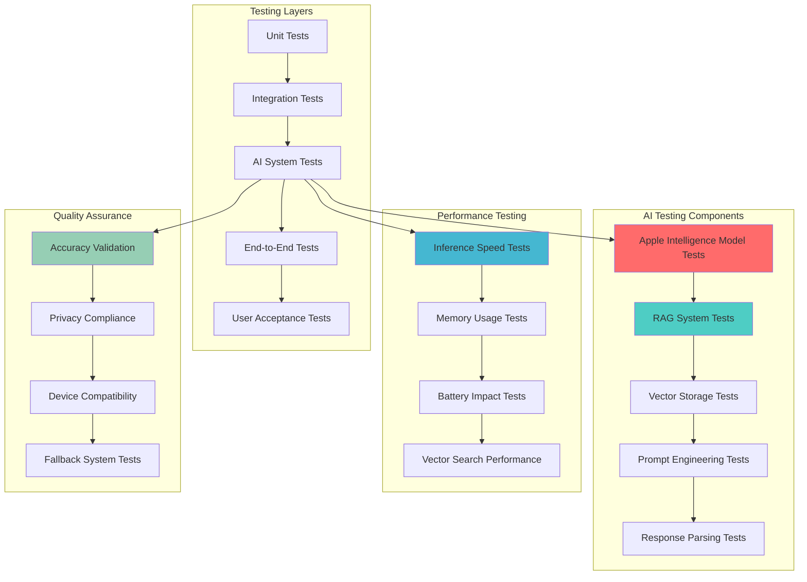
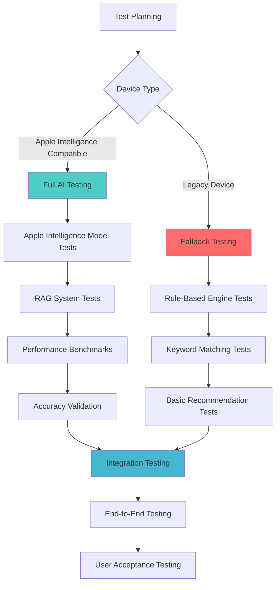

# Testing Strategy & Quality Assurance

## Testing Overview

### Testing Philosophy
- **Test Early, Test Often**: Integrate testing throughout development
- **User-Centric Testing**: Focus on real user scenarios and pain points
- **Performance Testing**: Ensure app remains responsive and efficient
- **Accessibility Testing**: Ensure app is usable by all users
- **AI-Specific Testing**: Comprehensive testing of Apple Intelligence and RAG systems

## AI Testing Architecture



## AI Testing Strategy



### Testing Pyramid
```
    /\
   /  \     E2E Tests (10%)
  /____\    Integration Tests (20%)
 /______\   Unit Tests (70%)
```

## Unit Testing Strategy

### 1. Core Business Logic Testing

#### Recommendation Engine Tests
```swift
class RecommendationEngineTests: XCTestCase {
    var engine: RecommendationEngine!
    var mockCards: [CreditCard]!
    
    override func setUp() {
        super.setUp()
        engine = RecommendationEngine()
        mockCards = createMockCards()
    }
    
    func testGroceriesRecommendation() {
        // Given
        let query = "I'm buying groceries at Whole Foods"
        let request = RecommendationRequest(
            userQuery: query,
            spendingCategory: .groceries,
            merchant: "whole foods",
            amount: 100.0,
            userPreferences: defaultPreferences,
            userCards: mockCards
        )
        
        // When
        let response = engine.getRecommendation(for: request)
        
        // Then
        XCTAssertEqual(response.primaryRecommendation.cardName, "Amex Gold")
        XCTAssertEqual(response.primaryRecommendation.multiplier, 4.0)
        XCTAssertTrue(response.reasoning.contains("4x MR points"))
    }
    
    func testLimitReachedScenario() {
        // Given
        let cardWithReachedLimit = createCardWithReachedLimit()
        let request = RecommendationRequest(
            userQuery: "Buying groceries",
            spendingCategory: .groceries,
            userCards: [cardWithReachedLimit]
        )
        
        // When
        let response = engine.getRecommendation(for: request)
        
        // Then
        XCTAssertTrue(response.warnings.contains("limit reached"))
        XCTAssertEqual(response.primaryRecommendation.rank, 2)
    }
    
    func testPreferenceBasedRecommendation() {
        // Given
        let preferences = UserPreferences(preferredPointSystem: .ultimateRewards)
        let request = RecommendationRequest(
            userQuery: "Dining out",
            spendingCategory: .dining,
            userPreferences: preferences,
            userCards: mockCards
        )
        
        // When
        let response = engine.getRecommendation(for: request)
        
        // Then
        XCTAssertTrue(response.primaryRecommendation.pointType == .ultimateRewards)
    }
}
```

#### Card Scoring Tests
```swift
class CardScoringTests: XCTestCase {
    func testCategoryScoreCalculation() {
        // Given
        let card = createAmexGoldCard()
        let category = SpendingCategory.groceries
        
        // When
        let score = calculateCategoryScore(card, category)
        
        // Then
        XCTAssertEqual(score, 4.0)
    }
    
    func testLimitScoreCalculation() {
        // Given
        let card = createCardWithLimit(used: 900, limit: 1000)
        let category = SpendingCategory.groceries
        
        // When
        let score = calculateLimitScore(card, category)
        
        // Then
        XCTAssertEqual(score, 0.5) // Warning threshold
    }
    
    func testPreferenceScoreCalculation() {
        // Given
        let card = createChaseCard()
        let preferences = UserPreferences(preferredPointSystem: .ultimateRewards)
        
        // When
        let score = calculatePreferenceScore(card, preferences)
        
        // Then
        XCTAssertEqual(score, 1.2) // 20% bonus
    }
}
```

#### NLP Processing Tests
```swift
class NLPProcessorTests: XCTestCase {
    var processor: NLPProcessor!
    
    override func setUp() {
        super.setUp()
        processor = NLPProcessor()
    }
    
    func testCategoryExtraction() {
        // Given
        let queries = [
            "buying groceries" -> SpendingCategory.groceries,
            "dining out" -> SpendingCategory.dining,
            "filling up gas" -> SpendingCategory.gas,
            "booking a flight" -> SpendingCategory.travel
        ]
        
        for (query, expectedCategory) in queries {
            // When
            let parsed = processor.parseUserQuery(query)
            
            // Then
            XCTAssertEqual(parsed.spendingCategory, expectedCategory)
        }
    }
    
    func testMerchantExtraction() {
        // Given
        let query = "shopping at Costco"
        
        // When
        let parsed = processor.parseUserQuery(query)
        
        // Then
        XCTAssertEqual(parsed.merchant, "costco")
        XCTAssertEqual(parsed.spendingCategory, .costco)
    }
    
    func testAmountExtraction() {
        // Given
        let query = "spending $150 on groceries"
        
        // When
        let parsed = processor.parseUserQuery(query)
        
        // Then
        XCTAssertEqual(parsed.amount, 150.0)
    }
}
```

### 2. Data Layer Testing

#### Core Data Tests
```swift
class CoreDataTests: XCTestCase {
    var coreDataStack: CoreDataStack!
    var context: NSManagedObjectContext!
    
    override func setUp() {
        super.setUp()
        coreDataStack = CoreDataStack(inMemory: true)
        context = coreDataStack.context
    }
    
    func testCardCreation() {
        // Given
        let cardData = CreditCardData(
            name: "Amex Gold",
            cardType: .amexGold,
            rewardCategories: [.groceries, .dining]
        )
        
        // When
        let card = try! DataManager.createCard(cardData, in: context)
        
        // Then
        XCTAssertEqual(card.name, "Amex Gold")
        XCTAssertEqual(card.rewardCategories.count, 2)
        XCTAssertTrue(card.rewardCategories.contains { $0.category == .groceries })
    }
    
    func testCardDeletion() {
        // Given
        let card = try! DataManager.createCard(mockCardData, in: context)
        
        // When
        try! DataManager.deleteCard(card, in: context)
        
        // Then
        let remainingCards = try! DataManager.fetchCards(in: context)
        XCTAssertEqual(remainingCards.count, 0)
    }
}
```

### 3. ViewModel Testing

#### ChatViewModel Tests
```swift
class ChatViewModelTests: XCTestCase {
    var viewModel: ChatViewModel!
    var mockRecommendationEngine: MockRecommendationEngine!
    var mockDataManager: MockDataManager!
    
    override func setUp() {
        super.setUp()
        mockRecommendationEngine = MockRecommendationEngine()
        mockDataManager = MockDataManager()
        viewModel = ChatViewModel(
            recommendationEngine: mockRecommendationEngine,
            dataManager: mockDataManager
        )
    }
    
    func testSendMessage() {
        // Given
        viewModel.inputText = "Buying groceries"
        
        // When
        viewModel.sendMessage()
        
        // Then
        XCTAssertEqual(viewModel.messages.count, 2) // User + AI response
        XCTAssertEqual(viewModel.messages.first?.sender, .user)
        XCTAssertEqual(viewModel.messages.first?.content, "Buying groceries")
        XCTAssertTrue(viewModel.inputText.isEmpty)
    }
    
    func testErrorHandling() {
        // Given
        mockRecommendationEngine.shouldFail = true
        
        // When
        viewModel.inputText = "Test query"
        viewModel.sendMessage()
        
        // Then
        XCTAssertNotNil(viewModel.errorMessage)
        XCTAssertFalse(viewModel.isTyping)
    }
}
```

## Integration Testing

### 1. End-to-End Workflows

#### Complete Recommendation Flow
```swift
class RecommendationFlowTests: XCTestCase {
    func testCompleteRecommendationFlow() {
        // Given
        let app = XCUIApplication()
        app.launch()
        
        // When - Add a card
        app.tabBars.buttons["My Cards"].tap()
        app.buttons["Add Card"].tap()
        app.textFields["Card Name"].tap()
        app.textFields["Card Name"].typeText("Amex Gold")
        app.buttons["Save"].tap()
        
        // When - Ask for recommendation
        app.tabBars.buttons["Chat"].tap()
        app.textFields["Type your question..."].tap()
        app.textFields["Type your question..."].typeText("Buying groceries")
        app.buttons["Send"].tap()
        
        // Then
        let recommendation = app.staticTexts.containing(NSPredicate(format: "label CONTAINS 'Amex Gold'"))
        XCTAssertTrue(recommendation.element.exists)
    }
}
```

### 2. Data Flow Testing

#### Chat to Recommendation Integration
```swift
class ChatIntegrationTests: XCTestCase {
    func testChatToRecommendationIntegration() {
        // Given
        let chatViewModel = ChatViewModel()
        let recommendationEngine = RecommendationEngine()
        let dataManager = DataManager()
        
        // When
        let query = "Buying groceries at Whole Foods"
        let response = recommendationEngine.getRecommendation(for: query)
        
        // Then
        XCTAssertNotNil(response.primaryRecommendation)
        XCTAssertTrue(response.reasoning.contains("4x"))
    }
}
```

## UI Testing

### 1. User Interface Tests

#### Navigation Tests
```swift
class NavigationUITests: XCTestCase {
    func testTabNavigation() {
        let app = XCUIApplication()
        app.launch()
        
        // Test Chat tab
        app.tabBars.buttons["Chat"].tap()
        XCTAssertTrue(app.navigationBars["Credit Card Assistant"].exists)
        
        // Test My Cards tab
        app.tabBars.buttons["My Cards"].tap()
        XCTAssertTrue(app.navigationBars["My Cards"].exists)
        
        // Test Settings tab
        app.tabBars.buttons["Settings"].tap()
        XCTAssertTrue(app.navigationBars["Settings"].exists)
    }
}
```

#### Chat Interface Tests
```swift
class ChatUITests: XCTestCase {
    func testChatMessageSending() {
        let app = XCUIApplication()
        app.launch()
        
        let inputField = app.textFields["Type your question..."]
        let sendButton = app.buttons["Send"]
        
        // Test empty message
        sendButton.tap()
        XCTAssertEqual(app.staticTexts.count, 1) // Only welcome message
        
        // Test valid message
        inputField.tap()
        inputField.typeText("Buying groceries")
        sendButton.tap()
        
        // Verify message appears
        let userMessage = app.staticTexts["Buying groceries"]
        XCTAssertTrue(userMessage.exists)
    }
}
```

### 2. Accessibility Testing

#### VoiceOver Tests
```swift
class AccessibilityTests: XCTestCase {
    func testVoiceOverLabels() {
        let app = XCUIApplication()
        app.launch()
        
        // Test tab bar accessibility
        let chatTab = app.tabBars.buttons["Chat"]
        XCTAssertTrue(chatTab.isAccessibilityElement)
        XCTAssertNotNil(chatTab.accessibilityLabel)
        
        // Test chat input accessibility
        let inputField = app.textFields["Type your question..."]
        XCTAssertTrue(inputField.isAccessibilityElement)
        XCTAssertNotNil(inputField.accessibilityHint)
    }
}
```

## Performance Testing

### 1. Response Time Testing

#### Recommendation Performance
```swift
class PerformanceTests: XCTestCase {
    func testRecommendationResponseTime() {
        let engine = RecommendationEngine()
        let request = createTestRequest()
        
        measure {
            let response = engine.getRecommendation(for: request)
            XCTAssertNotNil(response)
        }
    }
    
    func testChatMessageProcessing() {
        let viewModel = ChatViewModel()
        
        measure {
            viewModel.inputText = "Buying groceries"
            viewModel.sendMessage()
        }
    }
}
```

### 2. Memory Usage Testing

#### Memory Leak Detection
```swift
class MemoryTests: XCTestCase {
    func testNoMemoryLeaks() {
        weak var weakViewModel: ChatViewModel?
        
        autoreleasepool {
            let viewModel = ChatViewModel()
            weakViewModel = viewModel
            
            // Simulate usage
            viewModel.inputText = "Test"
            viewModel.sendMessage()
        }
        
        // Check for memory leaks
        XCTAssertNil(weakViewModel)
    }
}
```

## User Acceptance Testing

### 1. Real User Scenarios

#### Common Use Cases
```swift
class UserAcceptanceTests: XCTestCase {
    func testGroceryShoppingScenario() {
        // User wants to buy groceries at Whole Foods
        // Should recommend Amex Gold with 4x points
        // Should show current spending progress
        // Should warn if limit is approaching
    }
    
    func testDiningOutScenario() {
        // User wants to dine at a restaurant
        // Should recommend Amex Gold with 4x points
        // Should show dining category progress
    }
    
    func testLimitReachedScenario() {
        // User's Freedom card quarterly bonus is maxed out
        // Should recommend alternative card
        // Should explain why primary card wasn't chosen
    }
}
```

### 2. Edge Case Testing

#### Error Scenarios
```swift
class EdgeCaseTests: XCTestCase {
    func testNoCardsAdded() {
        // User hasn't added any cards
        // Should show helpful message to add cards
    }
    
    func testUnrecognizedCategory() {
        // User asks about obscure spending category
        // Should provide general recommendation
    }
    
    func testAllLimitsReached() {
        // All cards have reached their limits
        // Should recommend best base rewards card
    }
}
```

## Test Data Management

### 1. Mock Data Creation
```swift
class TestDataFactory {
    static func createMockCards() -> [CreditCard] {
        return [
            createAmexGoldCard(),
            createChaseFreedomCard(),
            createChaseSapphireReserveCard()
        ]
    }
    
    static func createAmexGoldCard() -> CreditCard {
        // Create Amex Gold with groceries and dining categories
    }
    
    static func createChaseFreedomCard() -> CreditCard {
        // Create Chase Freedom with quarterly bonus
    }
}
```

### 2. Test Environment Setup
```swift
class TestEnvironment {
    static func setupTestEnvironment() {
        // Use in-memory Core Data stack
        // Load test data
        // Configure test preferences
    }
    
    static func cleanupTestEnvironment() {
        // Clean up test data
        // Reset preferences
    }
}
```

## Continuous Integration

### 1. Automated Testing Pipeline
```yaml
# GitHub Actions workflow
name: Tests
on: [push, pull_request]
jobs:
  test:
    runs-on: macos-latest
    steps:
      - uses: actions/checkout@v2
      - name: Run Unit Tests
        run: xcodebuild test -scheme CreditCardApp -destination 'platform=iOS Simulator,name=iPhone 14'
      - name: Run UI Tests
        run: xcodebuild test -scheme CreditCardAppUITests -destination 'platform=iOS Simulator,name=iPhone 14'
```

### 2. Test Coverage Requirements
- **Unit Tests**: 80%+ code coverage
- **Integration Tests**: All major workflows
- **UI Tests**: Critical user paths
- **Performance Tests**: Response time < 2 seconds

## Quality Metrics

### 1. Success Criteria
- **Functionality**: 100% of user stories working
- **Performance**: < 2 second response time
- **Reliability**: 99%+ uptime
- **Accessibility**: WCAG 2.1 AA compliance

### 2. Bug Tracking
- **Critical**: Must fix before release
- **High**: Fix in current sprint
- **Medium**: Fix in next sprint
- **Low**: Fix when convenient

### 3. Release Criteria
- All critical and high priority bugs fixed
- All tests passing
- Performance benchmarks met
- Accessibility requirements satisfied
- User acceptance testing completed 